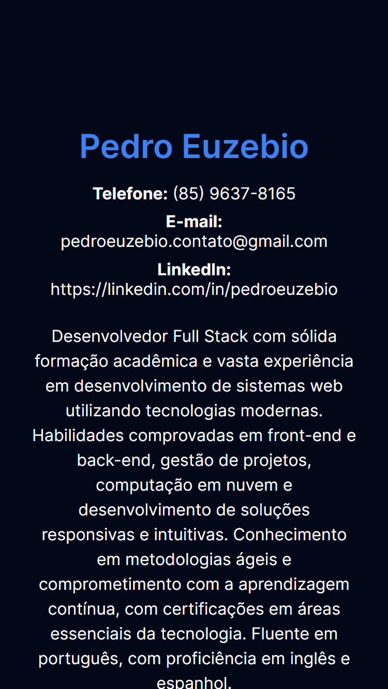

# Atividade Prática: Criando um Portfólio Simples

**Aberto:** segunda-feira, 17 jun. 2024, 00:00

**Vencimento:** quinta-feira, 20 jun. 2024, 23:59

**Objetivo:** Os alunos irão criar uma página web simples que servirá como um portfólio pessoal. Esta página deve utilizar os conceitos de CSS abordados nas aulas, como CSS inline, o atributo style, a tag style, CSS em arquivos externos, seletores, classes, unidades, e Google Fonts.

**Instruções:**

1. Estrutura HTML Básica:
   - Crie um arquivo HTML chamado `index.html`.
   - Adicione a estrutura básica do HTML5 (tags `<!DOCTYPE html>, <html>, <head>, e <body>`).
2. Estilo Inline:
   - No corpo do documento, adicione um título (`<h1>`) com seu nome. Use CSS inline para alterar a cor do texto deste título.
3. Atributo Style:
   - No corpo do documento, adicione um título (`<h1>`) com seu nome. Use CSS inline para alterar a cor do texto deste título.
4. Tag Style:
   - Adicione um parágrafo (`
`) abaixo do título com uma breve descrição sobre você. Utilize o atributo style para definir o tamanho da fonte e a cor do parágrafo.
5. CSS Externo:
   - Dentro da tag `<head>`, adicione uma tag `<style>` e defina um estilo para todas as tags `<h2>` para que tenham uma cor diferente e um espaçamento superior.
6. Classes e IDs:
   - Adicione uma seção (`<section>`) para suas habilidades. Dentro desta seção, crie uma lista (`<ul>`) com pelo menos três habilidades.
   - Adicione classes aos itens da lista (`<li>`) e defina estilos diferentes para cada classe no styles.css.
7. Seletores:
   - Utilize seletores restritivos no `styles.css` para estilizar elementos específicos dentro de suas seções. Por exemplo, estilize todos os parágrafos dentro de uma div com a classe `.bio`.
8. Unidades Absolutas e Relativas:
   - No `styles.css`, defina o tamanho das fontes usando unidades absolutas (como `px`) e relativas (como `em` ou `%`).
   - Adicione margens e paddings utilizando unidades relativas.
9. Google Fonts:
   - Visite o site Google Fonts, escolha uma fonte que você goste e incorpore-a em seu projeto.
   - No `styles.css`, utilize a fonte escolhida para estilizar o texto de sua página.
10. Verificação e Ajustes:
    - Verifique como a página está ficando no navegador e faça ajustes conforme necessário.
    - Assegure-se de que os estilos estão sendo aplicados corretamente e que a página é responsiva.

**Entrega:**

- Inclua uma captura de tela da página final exibida em um navegador.

## Resolução

### Versão Mobile

   

### Versão Desktop

   

