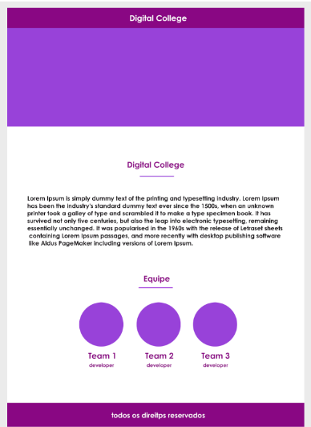

# Atividade de CSS

**Aberto:** terça-feira, 18 jun. 2024, 00:00

**Vencimento:** sexta-feira, 21 jun. 2024, 23:59

Com base nos conhecimentos adquiridos hoje, vamos nos desafiar?!

Utilizando a referência abaixo vamos produzir mais uma página utilizando HTML e CSS e buscando aplicar os conceitos de hoje!

**Objetivo:** Reproduzir a estrutura e o estilo visual da página conforme a imagem fornecida, utilizando as propriedades do Box Model, display, padding, border, entre outras de CSS.

**Instruções:**

1. **Estrutura HTML:**

   - Crie uma estrutura HTML com as seguintes seções:
     - Um cabeçalho com o nome "Digital College".
     - Um bloco de conteúdo central com o título "Digital College" e um parágrafo de texto.
     - Uma seção "Equipe" contendo três blocos de informações para cada time (Team 1, Team 2, Team 3).
     - Um rodapé com o texto "todos os direitos reservados".

2. **Estilos CSS:**

   - Crie um arquivo CSS para estilizar a página conforme a imagem fornecida.
   - Utilize o Box Model para definir margens, preenchimentos, e bordas.
   - Use propriedades de display para alinhar e organizar os elementos.

3. **Entrega:**
   - Nos envie a imagem ou a pasta zipada com os arquivos.

**BOA PRÁTICA!**

## Resolução

### Versão Mobile

   

### Versão Desktop

   

