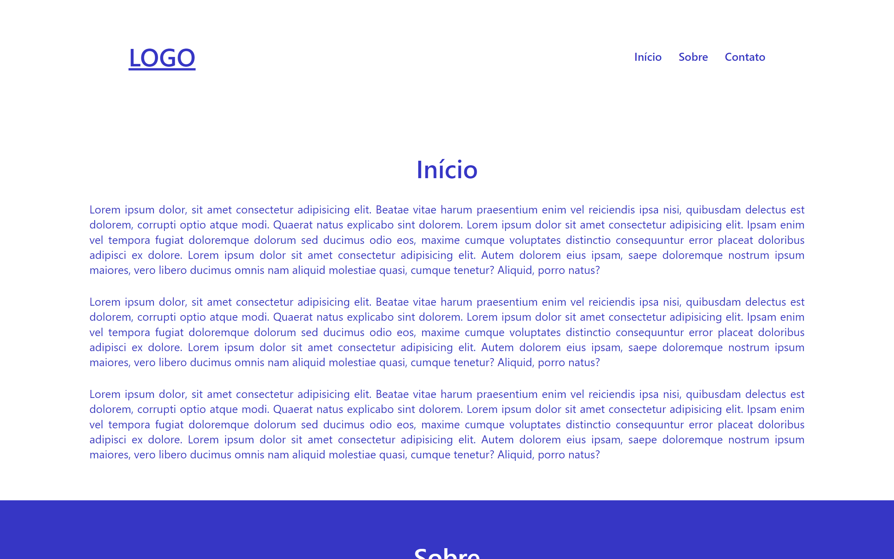
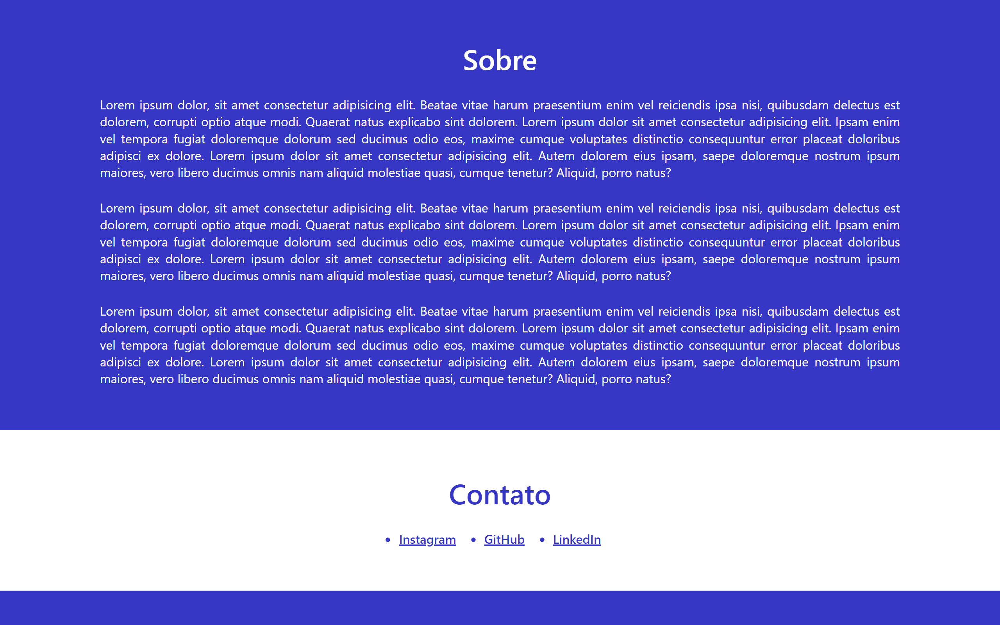
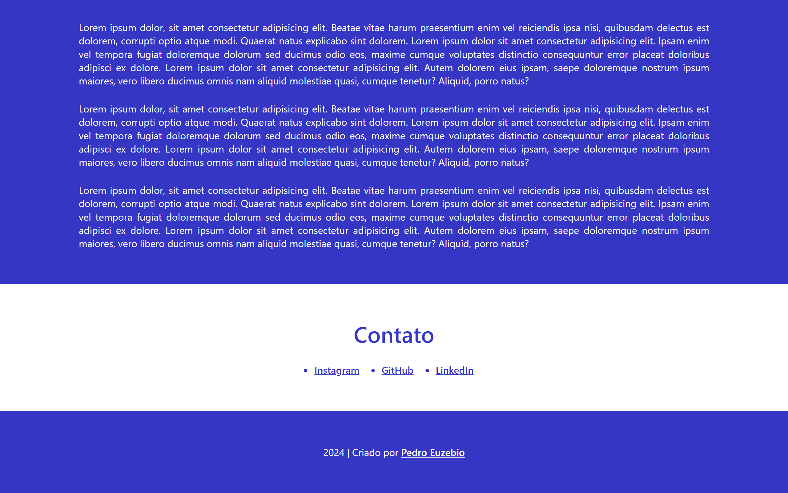

# Exercício de Fixação

**Aberto:** terça-feira, 2 jul. 2024, 00:00

Tente criar mais alguns componentes por conta própria e usá-los dentro do componente App. Experimente adicionar diferentes tipos de conteúdo e veja como o React facilita a construção de interfaces dinâmicas.

Nos vemos na próxima aula! Até lá!

## Resolução do Exercício de Fixação

