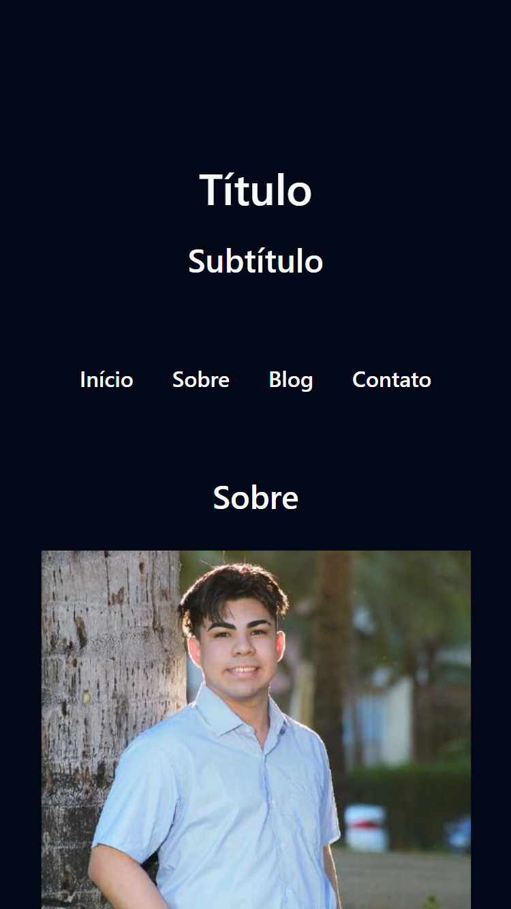
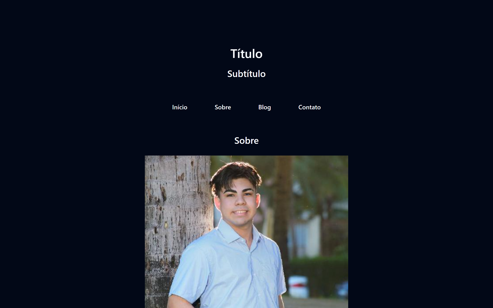

# Atividade 01

**Aberto:** quarta-feira, 12 jun. 2024, 08:00

**Vencimento:** sábado, 15 jun. 2024, 23:58

## Objetivo

Criar uma página web simples e semântica, utilizando corretamente as tags HTML para estruturar o conteúdo de maneira clara e organizada.

## Instruções

1. Configuração Inicial:
   - Crie um novo arquivo HTML chamado index.html
   - Estruture o documento HTML básico com as tags `<!DOCTYPE html>`, `<html>`, `<head>`, e `<body>`.
2. Cabeçalho da Página:
   - Dentro da tag `<head>`, adicione a tag `<title>` com o título da sua página.
   - Adicione uma tag `<meta>` para definir o charset como UTF-8.
3. Corpo da Página:
   - Dentro da tag `<body>`, crie as seguintes seções usando tags semânticas:
     - **Header:** Utilize a tag `<header>` para incluir um título da página (`<h1>`) e um subtítulo (`<h2>`).
     - **Navegação:** Utilize a tag `<nav>` para criar um menu de navegação com links (`<a>`) para as diferentes seções da página (use tags `<ul>` e `<li>`).
     - **Seção Principal:** Utilize a tag `<main>` para o conteúdo principal da página. Dentro do `<main>`, adicione:
       - Um artigo (`<article>`) com um título (`<h2>`) e um parágrafo (`
`).
       - Uma seção (`<section>`) com um título (`<h3>`) e uma lista não ordenada (`<ul>` e `<li>`).

## Entrega

- Os alunos devem salvar o arquivo `index.html` e abrir no navegador para verificar se a estrutura está correta e se os estilos básicos foram aplicados.
- Com o arquivo correto, vocês podem inserir ele no campo de entrega ou colocar o código dentro da caixa de entrega!

## Resolução

### Versão Mobile

   

### Versão Desktop

   

