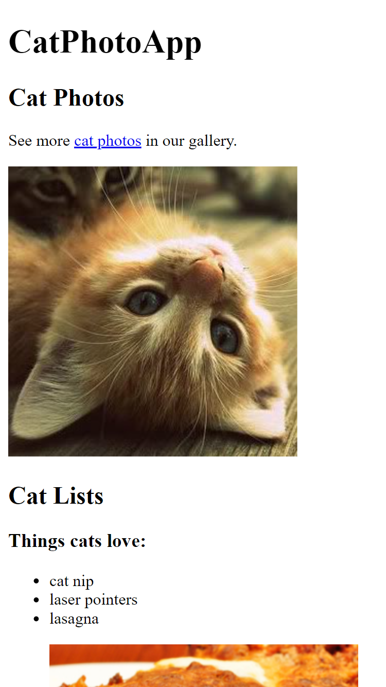
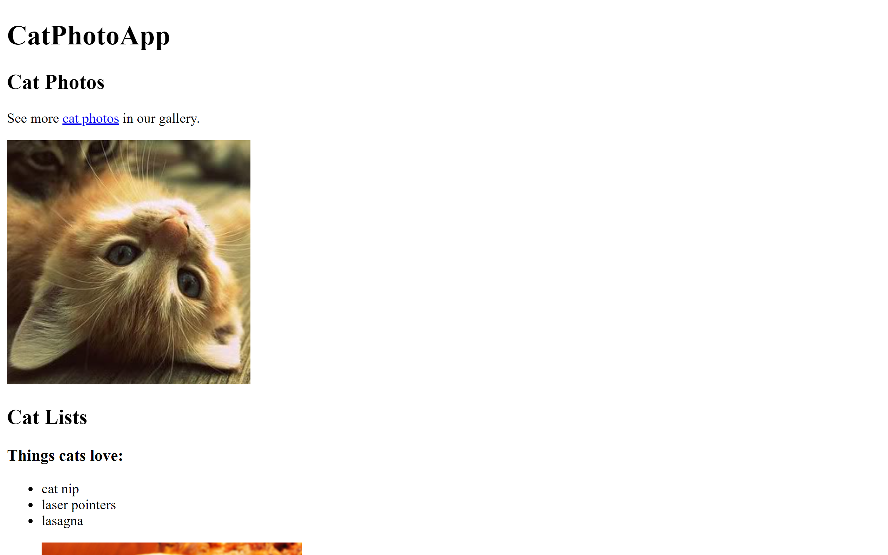

<h1>Instruções para o Desafio de HTML do Free Code Camp</h1>

  <strong>Aberto:</strong> sexta-feira, 14 jun. 2024, 00:00
   
<strong>Vencimento:</strong> segunda-feira, 17 jun. 2024, 23:59

<h2>Passo a Passo:</h2>

<ol>
  <li>
    <strong>Acessando o Free Code Camp:</strong>
    <ul>
      <li>Abra seu navegador de internet e acesse o site Free Code Camp.</li>
    </ul>
  </li>
  <li>
    <strong>Criando uma Conta:</strong>
    <ul>
      <li>
        Caso ainda não tenha uma conta, clique em "Sign In" no canto superior direito e siga as instruções para criar uma conta gratuita. Você pode se inscrever usando seu endereço de e-mail, conta do Google ou conta do GitHub.
      </li>
    </ul>
  </li>
  <li>
    <strong>Mudando a Linguagem para Português:</strong>
    <ul>
      <li>
        Para mudar a linguagem do site para Português, role a página até o final e clique no botão "Change Language" ou "Change Language" na parte inferior da página.
      </li>
      <li>
        Selecione "Português" na lista de idiomas.
      </li>
    </ul>
  </li>
  <li>
    <strong>Iniciando os Desafios de HTML:</strong>
    <ul>
      <li>
        No menu principal, clique em "Learn" (ou "Aprender" se você já alterou o idioma para Português).
      </li>
      <li>
        No menu lateral esquerdo, selecione "Responsive Web Design Certification" e depois clique em "Basic HTML and HTML5".
      </li>
      <li>
        Comece a trabalhar nos desafios, lendo atentamente as instruções e executando o código conforme solicitado.
      </li>
    </ul>
  </li>
  <li>
    <strong>Salvando e Enviando seu Progresso:</strong>
    <ul>
      <li>
        À medida que você conclui cada desafio, o Free Code Camp salvará automaticamente seu progresso.
      </li>
      <li>
        Trabalhe nos desafios até onde conseguir. Quando estiver satisfeito com o seu progresso ou tiver alcançado um ponto em que gostaria de enviar seu trabalho, copie o código HTML que você produziu.
      </li>
    </ul>
  </li>
  <li>
    <strong>Enviando seu Código:</strong>
    <ul>
      <li>
        Cole o código HTML que você completou na plataforma na aba de entrega da atividade.
      </li>
  </li>
</ol>

## Resolução

### Versão Mobile

   

### Versão Desktop

   

