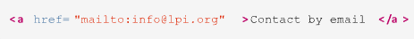
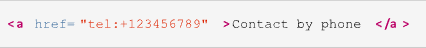
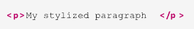

# Dia 03 (13/06/2024)

Este é o nosso terceiro dia de conteúdo!

Hoje seus estudos levarão a você a responder a seguinte pergunta: O que são as Tags de HTML?

Para responder a essa pergunta, será necessário entender a anatomia de um documento HTML e as principais tags utilizadas na criação de páginas web.

É esperado que, ao final, você seja capaz de:

- Explicar o que são as tags de HTML
- Descrever a estrutura básica de um documento HTML
- Identificar e utilizar as principais tags HTML em um documento HTML

## Roteiro

- [Dia 03 (13/06/2024)](#dia-03-13062024)
  - [Roteiro](#roteiro)
  - [Tags HTML](#tags-html)
    - [Aula 01](#aula-01)
    - [Aula 01 - Parte 2](#aula-01---parte-2)
  - [O elemento header](#o-elemento-header)
  - [O elemento nav](#o-elemento-nav)
  - [Âncoras](#âncoras)
    - [Continuação](#continuação)
    - [Aula 02](#aula-02)
    - [Aula 02 - Parte 02](#aula-02---parte-02)
  - [Áudio e vídeo](#áudio-e-vídeo)
    - [Aula 03](#aula-03)
    - [Aula 03 - Parte 2](#aula-03---parte-2)
  - [O atributo style](#o-atributo-style)
    - [Parte 02](#parte-02)
    - [Aula 04](#aula-04)

## Tags HTML

Definição de Tags HTML

Tags HTML são os elementos básicos utilizados para construir e organizar o conteúdo de uma página web. Cada tag define um tipo específico de conteúdo ou estrutura, como títulos, parágrafos, imagens, links, tabelas e muito mais. As tags HTML são escritas entre colchetes angulares, como `<tag>`, e geralmente vêm em pares: uma tag de abertura `<tag>` e uma tag de fechamento `</tag>`.

Por exemplo:

- `<p>` define um parágrafo.
- `<h1>` define um título de nível 1.
- `<a>` define um link.
- `` define uma imagem.

Algumas tags, como `` e `<br>`, são tags autossuficientes e não têm uma tag de fechamento. As tags HTML são essenciais para definir a estrutura e o conteúdo das páginas web, permitindo que os navegadores interpretem e exibam as informações de maneira correta e organizada.

Aqui está uma lista abrangente das tags HTML, organizadas por categorias principais:

Tags Estruturais

- `<!DOCTYPE>`: Define o tipo de documento.
- `<html>`: Elemento raiz de um documento HTML.
- `<head>`: Contém metadados sobre o documento.
- `<title>`: Define o título do documento.
- `<body>`: Contém o conteúdo visível do documento.

Tags de Cabeçalho e Metadados

- `<meta>`: Define metadados sobre o documento.
- `<link>`: Utilizado para vincular recursos externos, como folhas de estilo.
- `<style>`: Define estilos CSS internos.
- `<script>`: Contém scripts JavaScript.

Tags de Seção

- `<header>`: Define o cabeçalho de uma seção ou página.
- `<nav>`: Define uma seção de navegação.
- `<main>`: Contém o conteúdo principal do documento.
- `<section>`: Define uma seção genérica do documento.
- `<article>`: Define conteúdo independente, como um artigo.
- `<aside>`: Define conteúdo relacionado, mas separado do conteúdo principal.
- `<footer>`: Define o rodapé de uma seção ou página.

Tags de Conteúdo

- `<h1>`, `<h2>`, `<h3>`, `<h4>`, `<h5>`, `<h6>`: Definem cabeçalhos de diferentes níveis.
- `<p>`: Define um parágrafo.
- `<div>`: Define uma divisão ou seção genérica.
- `<span>`: Define uma seção em linha genérica.
- `<a>`: Define um link.
- ``: Define uma imagem.
- `<br>`: Insere uma quebra de linha.
- `<hr>`: Insere uma linha horizontal.

Tags de Lista

- `<ul>`: Define uma lista não ordenada.
- `<ol>`: Define uma lista ordenada.
- `<li>`: Define um item de lista.
- `<dl>`: Define uma lista de definição.
- `<dt>`: Define um termo na lista de definição.
- `<dd>`: Define uma descrição do termo na lista de definição.

Tags de Formulário

- `<form>`: Define um formulário.
- `<input>`: Define um campo de entrada.
- `<textarea>`: Define uma área de texto.
- `<button>`: Define um botão.
- `<label>`: Define um rótulo para um campo de formulário.
- `<fieldset>`: Agrupa elementos de formulário.
- `<legend>`: Define uma legenda para um `<fieldset>`.
- `<select>`: Define uma lista suspensa.
- `<option>`: Define uma opção em uma lista suspensa.
- `<optgroup>`: Define um grupo de opções em uma lista suspensa.

Tags de Tabela

- `<table>`: Define uma tabela.
- `<caption>`: Define uma legenda para a tabela.
- `<thead>`: Agrupa o cabeçalho de uma tabela.
- `<tbody>`: Agrupa o corpo de uma tabela.
- `<tfoot>`: Agrupa o rodapé de uma tabela.
- `<tr>`: Define uma linha de tabela.
- `<th>`: Define uma célula de cabeçalho.
- `<td>`: Define uma célula de dados.

Tags Multimídia

- `<audio>`: Define conteúdo de áudio.
- `<video>`: Define conteúdo de vídeo.
- `<source>`: Define várias fontes de mídia para elementos `<audio>` e `<video>`.
- `<track>`: Define faixas de texto para elementos `<audio>` e `<video>`.
- `<embed>`: Define conteúdo incorporado.
- `<object>`: Define um objeto incorporado.
- `<param>`: Define parâmetros para elementos `<object>`.
- `<iframe>`: Define um quadro embutido.

Tags Semânticas

- `<abbr>`: Define uma abreviação.
- `<address>`: Define informações de contato.
- `<b>`: Define texto em negrito.
- `<bdi>`: Isola partes de texto que podem ter uma direção de texto diferente.
- `<bdo>`: Substitui a direção do texto.
- `<blockquote>`: Define uma seção citada.
- `<cite>`: Define o título de uma obra.
- `<code>`: Define um trecho de código.
- `<del>`: Define texto que foi excluído.
- `<dfn>`: Define um termo definido.
- `<em>`: Define texto enfatizado.
- `<i>`: Define texto em itálico.
- `<ins>`: Define texto que foi inserido.
- `<kbd>`: Define entrada de teclado.
- `<mark>`: Define texto destacado.
- `<pre>`: Define texto pré-formatado.
- `<q>`: Define uma citação curta.
- `<s>`: Define texto que não é mais correto.
- `<samp>`: Define saída de computador.
- `<small>`: Define texto pequeno.
- `<strong>`: Define texto forte.
- `<sub>`: Define texto subscrito.
- `<sup>`: Define texto sobrescrito.
- `<time>`: Define uma data/hora.
- `<u>`: Define texto sublinhado.
- `<var>`: Define uma variável.
- `<wbr>`: Define uma possível quebra de linha.

Essa lista cobre as principais tags HTML utilizadas na criação de páginas web. Cada uma dessas tags possui atributos específicos que podem ser utilizados para definir suas propriedades e comportamentos.

### Aula 01

### Aula 01 - Parte 2

## O elemento header

O elemento `<header>` (cabeçalho) contém informações introdutórias ao elemento semântico circundante dentro de um documento HTML. Um cabeçalho é diferente de um título, mas um cabeçalho geralmente inclui um elemento de título (`<h1>`, … , `<h6>`).

Na prática, esse elemento é mais frequentemente usado para representar o cabeçalho da página, como um banner com um logotipo. Também pode ser usado para introduzir o conteúdo dos seguintes elementos: `<body>`, `<section>`, `<article>`, `<nav>` ou `<aside>`.

Um mesmo documento pode ter múltiplos elementos `<header>`, mas um elemento `<header>` não pode ser aninhado dentro de outro elemento `<header>`. Um elemento `<footer>` também não pode ser usado dentro de um elemento `<header>`.

Por exemplo, para adicionar um cabeçalho ao nosso documento de exemplo, podemos fazer o seguinte:


Não haverá mudanças visíveis no documento HTML, já que `<h1>` (como todos os outros elementos de título) é um elemento de nível de bloco sem outras propriedades visuais.

## O elemento nav

O elemento `<nav>` descreve uma unidade de navegação importante, como um menu, que contém uma série de hiperlinks.

Nem todos os hiperlinks devem ser postos dentro de um elemento `<nav>`. Ele é útil para listar um grupo de links.

Como os hiperlinks ainda não foram abordados, o elemento de navegação não será incluído nos exemplos desta lição.


Notas de utilização da Documentação Mozilla (MDN):

- Nem todos os links de um documento devem estar dentro de um elemento `<nav>`, o qual é destinado apenas para grupos importantes de links de navegação; tipicamente o elemento `<footer>` contém uma lista de links que não precisam estar em um elemento `<nav>`.
- Um documento pode ter vários elementos `<nav>`, por exemplo, um para navegação no site e outro para navegação dentro da página.
- Agentes de usuário, como leitores de tela para usuários deficientes, podem utilizar este elemento para determinar se a renderização inicial do conteúdo do mesmo deve ser omitida.

## Âncoras

O elemento de página comumente chamado de link da web também é conhecido pelo termo técnico âncora (anchor), o que explica o uso da tag `<a>`. A âncora leva a outro local, que pode ser qualquer endereço compatível com o navegador. A localização é indicada pelo atributo href (hyperlink reference):


A localização pode ser informada como um caminho relativo ou absoluto, como acontece com o conteúdo incorporado de que falamos anteriormente. Somente o conteúdo de texto entre as tags (por exemplo, Contact Information) fica visível para o visitante, geralmente na forma de um texto em azul sublinhado e clicável, mas o item que contém o link também pode ser qualquer outro conteúdo visível, como imagens:


Prefixos especiais podem ser adicionados ao caminho para informar ao navegador como abri-lo. Se a âncora apontar para um endereço de email, por exemplo, seu atributo href deve incluir o prefixo mailto::



O prefixo tel: indica um número de telefone. Essa indicação é particularmente útil para visitantes que visualizam a página em dispositivos móveis:



Quando o link é clicado, o navegador abre o conteúdo do caminho com o aplicativo associado.

O uso mais comum das âncoras é carregar outros documentos da web. Por padrão, o navegador substitui o documento HTML atual pelo conteúdo do novo local. Esse comportamento pode ser modificado usando o atributo target. O destino \_blank, por exemplo, diz ao navegador para abrir o local fornecido em uma nova janela ou nova guia do navegador, dependendo das preferências do visitante:


### Continuação

O destino \_self é o padrão quando o atributo target não é fornecido. Ele faz com que o documento referenciado substitua o documento atual.

Outros tipos de destinos estão relacionados ao elemento `<iframe>`. Para carregar um documento referenciado dentro de um elemento `<iframe>`, o atributo target deve apontar para o nome do elemento iframe:


O elemento iframe funciona como uma janela distinta do navegador e, portanto, quaisquer links carregados a partir do documento dentro do iframe substituirão apenas o conteúdo do quadro. Para mudar esse comportamento, os elementos âncora dentro do documento aninhado também podem usar o atributo target. O destino \_parent, quando usado dentro de um documento aninhado, fará com que o local referenciado substitua o documento pai que contém a tag `<iframe>`. Por exemplo, o documento gallery.html incorporado pode conter uma âncora que carrega a si mesma e substitui o documento pai:


Os documentos HTML suportam vários níveis de aninhamento com a tag `<iframe>`. O destino \_top, quando usado em uma âncora dentro de um documento aninhado, fará com que o local referenciado substitua o documento principal na janela do navegador, independentemente de ele ser o pai imediato do `<iframe>` ou um ancestral mais distante.

### Aula 02

### Aula 02 - Parte 02

## Áudio e vídeo

Podemos adicionar conteúdos de áudio e vídeo a um documento HTML mais ou menos da mesma maneira que as imagens. Sem surpresa, a tag para adicionar áudio é `<audio>` e a tag para adicionar vídeo é `<video>`. Obviamente, os navegadores em modo texto não são capazes de reproduzir conteúdo multimídia, de forma que as tags `<audio>` e `<video>` empregam uma tag de fechamento para conter o texto usado como explicação para o elemento que não pôde ser mostrado. Por exemplo:


Se o navegador não suportar a tag `<audio>`, a linha “Unable to play recording.mp3” será mostrada em seu lugar. O uso das tags de fechamento `</audio>` ou `</video>`permitem que a página web inclua conteúdos alternativos mais elaborados do que a simples linha de texto permitida pelo atributo alt da tag ``.

O atributo src das tags `<audio>` e `<video>` funcionam da mesma forma que em ``, mas ele também aceita URLs apontando para uma transmissão ao vivo. O navegador cuida de armazenar em buffer, decodificar e exibir o conteúdo conforme ele é recebido. O atributo controls exibe os controles de reprodução. Sem ele, o visitante não poderá pausar, retroceder ou controlar a reprodução de qualquer outra maneira.

### Aula 03

### Aula 03 - Parte 2

## O atributo style

A maneira mais simples de modificar o estilo de um elemento específico é escrevê-lo diretamente na tag do elemento usando o atributo style. Todos os elementos HTML visíveis aceitam um atributo style, cujo valor pode ser uma ou mais regras de CSS, também conhecidas como propriedades. Vamos começar com um exemplo simples, um elemento de parágrafo:



A sintaxe básica de uma propriedade CSS personalizada é property: value, onde property é o aspecto particular que você deseja alterar no elemento e value define o que substituirá a opção padrão feita pelo navegador. Algumas propriedades se aplicam a todos os elementos e outras se aplicam apenas a elementos específicos. Da mesma forma, existem valores adequados a serem utilizados em cada propriedade.

Para mudar a cor do nosso parágrafo simples, por exemplo, usamos a propriedade color. A propriedade color refere-se à cor do primeiro plano, ou seja, a cor das letras do parágrafo. A cor em si é indicada na parte do valor da regra e pode ser especificada em vários formatos diferentes, incluindo nomes simples como red, green, blue, yellow etc. Assim, para deixar a letra do parágrafo roxa, adicione a propriedade personalizada color: purple ao atributo style do elemento:


Outras propriedades personalizadas podem entrar na mesma propriedade style, mas devem ser separadas por ponto e vírgula. Se você quiser aumentar o tamanho da fonte, por exemplo, adicione font-size: larger à propriedade style:


Para ver o resultado dessas alterações, salve o HTML a seguir em um arquivo e abra-o em um navegador web:

```html
<!DOCTYPE html>
<html>
  <head>
    <meta charset="utf-8" />
    <title>Css Basics</title>
  </head>
  <body>
    <p style="color: purple; font-size: larger" —>
      My first stylized paragraph
    </p>
    <p style="color: green; font-size: larger" —>
      My second stylized paragraph
    </p>
  </body>
</html>
```

### Parte 02

Fez o arquivo anterior? O resultado esperado no seu navegador é conforme a imagem abaixo:


Podemos imaginar cada elemento da página como um retângulo ou caixa cujas propriedades geométricas e decorações podem ser manipuladas com CSS. O mecanismo de renderização emprega dois conceitos básicos padrão para o posicionamento do elemento: posicionamento em bloco e posicionamento em linha. Os elementos de bloco ocupam todo o espaço horizontal do elemento pai e são posicionados sequencialmente, de cima para baixo. Sua altura (sua dimensão vertical, que não deve ser confundida com sua posição no alto da página) geralmente depende da quantidade de conteúdo que incluem. Os elementos em linha são posicionados horizontalmente, da esquerda para a direita, até que não haja mais espaço no lado direito; depois disso, o elemento continua em uma nova linha logo abaixo da atual. Elementos como p, div e section são posicionados como blocos por padrão, ao passo que elementos como span, em, a e letras sozinhas são posicionados em linha. Esses métodos básicos de posicionamento podem ser modificados fundamentalmente pelas regras do CSS.

O retângulo correspondente ao elemento p no corpo do documento HTML de amostra ficará visível se adicionarmos a propriedade background-color à regra:


Conforme adicionamos novas propriedades personalizadas de CSS ao atributo style, o código como um todo vai começando a ficar confuso. A inclusão de muitas regras de CSS no atributo style prejudica a separação entre a estrutura (HTML) e a apresentação (CSS). Além disso, você logo perceberá que muitos estilos são compartilhados entre diferentes elementos e não vale a pena repeti-los em cada um deles.

### Aula 04
