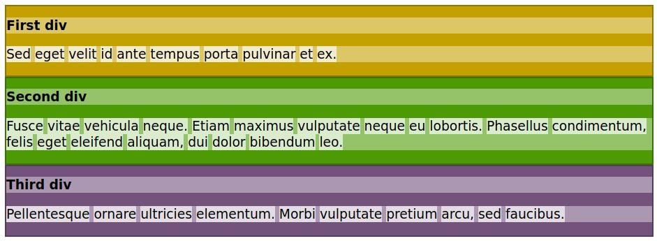
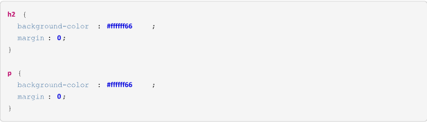
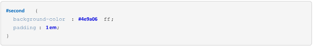
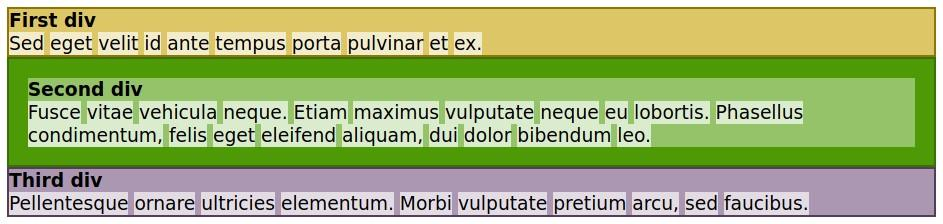
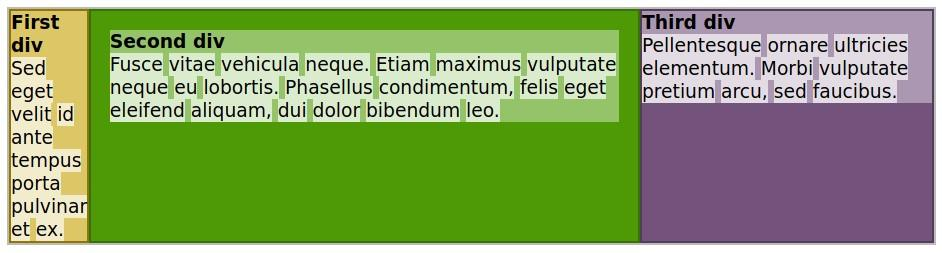

# Dia 06 (18/06/2024)

Bom dia!!

Hoje, vamos colocar em prática conceitos essenciais do CSS, focando principalmente no Box Model e nas propriedades de layout.

## Layout e modelo de caixa CSS

Cada um dos elementos visíveis em um documento HTML é renderizado como uma caixa retangular. Assim, o termo modelo de caixa descreve o método usado pelo CSS para modificar as propriedades visuais dos elementos. Como caixas de tamanhos diferentes, os elementos HTML podem ser aninhados dentro de elementos contêiner — normalmente o elemento div — e em seguida separados em seções.

Com o CSS, é possível modificar a posição das caixas, desde pequenos ajustes até mudanças drásticas na disposição dos elementos na página. Além do fluxo normal, a posição de cada caixa pode se basear nos elementos que a rodeiam, seja em seu relacionamento com o contêiner pai ou com a janela de visualização, que é a área da página visível para o usuário. Nenhum mecanismo atende a todos os requisitos de layout possíveis, então costuma ser necessário usar uma combinação deles.

### Fluxo normal

A forma padrão como o navegador renderiza a árvore do documento é chamada de fluxo normal. Os retângulos correspondentes aos elementos são postos mais ou menos na mesma ordem em que aparecem na árvore do documento em relação aos seus elementos pais. No entanto, dependendo do tipo de elemento, a caixa correspondente pode seguir regras de posicionamento distintas.

Uma boa maneira de entender a lógica do fluxo normal é tornar as caixas visíveis. Podemos começar com uma página bem básica contendo apenas três elementos div separados, cada um com um parágrafo de texto aleatório:


Cada palavra está em um elemento span para que possamos estilizá-las e constatar que são tratadas como caixas também. Para tornar as caixas visíveis, precisamos editar o arquivo de folha de estilo style.css referenciado pelo documento HTML. As seguintes regras fazem esse trabalho:


O resultado esperado no seu navegador é o que está ilustrado abaixo:



A Figura mostra que cada tag HTML tem uma caixa correspondente no layout. Os elementos div, h2 e p se estendem até a largura do corpo, ao passo que o pai de cada elemento h2 e p é o div correspondente. As caixas que se estendem pela largura de seu elemento pai são chamadas elementos de bloco. Algumas das tags HTML mais comuns representadas como blocos são h1, h2, h3, p, ul, ol, table, li, div, section, form e aside. Elementos de bloco irmãos — ou seja, que compartilham o mesmo elemento pai imediato — são empilhados dentro do pai, de cima para baixo.

OBS.: Alguns elementos de bloco não se destinam a ser usados como contêineres para outros elementos de bloco. É possível, por exemplo, inserir um elemento de bloco dentro de um elemento h1 ou p, mas isso não é muito aconselhável. Em vez disso, é melhor usar uma tag apropriada como contêiner. As tags de contêiner mais comuns são div, section e aside.

### Continuação

Além do texto em si, elementos como h1, p e li esperam conter apenas elementos de linha como filhos. Como a maioria dos modos de escrita ocidentais, os elementos de linha seguem o fluxo de texto da esquerda para a direita. Quando não há espaço restante no lado direito, o fluxo de elementos de linha continua na linha seguinte, assim como o texto. Algumas tags HTML comuns tratadas como caixas de linha são span, a, em, strong, img, input e label.

Em nossa página HTML de exemplo, todas as palavras dentro dos parágrafos foram circundadas por uma tag span, para que pudessem ser destacadas com uma regra CSS correspondente. Como mostrado na imagem, cada elemento span é posicionado horizontalmente da esquerda para a direita até que não haja mais espaço no elemento pai.

A altura do elemento depende de seu conteúdo. Portanto, o navegador ajusta a altura de um elemento de contêiner de forma a acomodar os elementos de bloco aninhados ou as linhas dos elementos de linha. No entanto, algumas propriedades CSS afetam a forma de uma caixa, sua posição e o posicionamento de seus elementos internos.

As propriedades margin e padding afetam todos os tipos de caixa. Se você não definir essas propriedades explicitamente, o navegador definirá algumas delas usando valores padrão. Conforme visto na Figure 35, os elementos h2 e p foram exibidos com um espacinho entre eles. Essas lacunas são as margens superior e inferior que o navegador adiciona por padrão a esses elementos. Podemos removê-las modificando as regras de CSS para os seletores h2 e p:



O resultado aparece na Figura abaixo:


O elemento body, por padrão, também inclui uma pequena margem que cria um espacinho ao redor dele. Essa lacuna também pode ser removida usando a propriedade margin.

Enquanto a propriedade margin (margem) define o espaço entre o elemento e seus arredores, a propriedade padding (preenchimento) do elemento define o espaço interno entre os limites do contêiner e seus elementos filhos. Considere os elementos h2 e p dentro de cada div em nosso código, por exemplo. Poderíamos usar a propriedade de margem deles para criar um espaço nas bordas do div correspondente, mas é mais simples alterar a propriedade padding do contêiner:



Apenas a regra para o segundo div foi modificada, por isso os resultados mostram a diferença entre o segundo div e os outros contêineres div.



A propriedade margin é uma abreviatura para quatro propriedades que controlam os quatro lados da caixa: margin-top, margin-right, margin-bottom e margin-left. Quando um único valor é atribuído a margin, como nos exemplos que vimos até agora, ele é aplicado nas quatro margens da caixa. Quando dois valores são escritos, o primeiro define as margens superior e inferior e o segundo, as margens direita e esquerda. A instrução margin: 1em 2em, por exemplo, define um espaço de 1 em para as margens superior e inferior e um espaço de 2 em para as margens direita e esquerda. Escrevemos quatro valores para definir as margens dos quatro lados em sentido horário, começando no topo. Os diferentes valores na propriedade abreviada não precisam usar as mesmas unidades.

A propriedade padding também é uma abreviatura e segue os mesmos princípios da propriedade margin.

Em seu comportamento padrão, os elementos de bloco são esticados para se ajustar à largura disponível. Mas isso não é obrigatório. A propriedade width define um tamanho horizontal fixo para a caixa:


O acréscimo de width: 6em à regra de CSS encolhe o primeiro div horizontalmente, deixando um espaço em branco à direita dele:


Em vez de deixar o primeiro div alinhado à esquerda, vamos centralizá-lo. Centralizar uma caixa é equivalente a definir margens do mesmo tamanho em ambos os lados; assim, podemos usar a propriedade de margem para centralizá-la. O tamanho do espaço disponível costuma variar, por isso usamos o valor auto para as margens esquerda e direita:


As margens esquerda e direita são calculadas automaticamente pelo navegador e a caixa é centralizada:


Como é fácil constatar, ao tornar um elemento de bloco mais estreito, não abrimos mais espaço para o elemento seguinte. O fluxo natural é preservado, como se o elemento mais estreito ainda ocupasse toda a largura disponível.

## Personalizando o fluxo normal

O fluxo normal é simples e sequencial. O CSS também permite interromper o fluxo normal e posicionar elementos de maneiras bastante específicas, até mesmo neutralizando a rolagem da página, se desejado. Veremos várias maneiras de controlar o posicionamento dos elementos nesta seção.

É possível fazer com que elementos de bloco irmãos compartilhem o mesmo espaço horizontal. Uma das maneiras é usar a propriedade float, que remove o elemento do fluxo normal. Como o próprio nome sugere, a propriedade float faz a caixa flutuar sobre os elementos do bloco que vêm depois, que são renderizados como se estivessem sob a caixa flutuante. Para fazer o primeiro div flutuar à direita, adicione float: right à regra CSS correspondente:


As margens automáticas são ignoradas em uma caixa flutuante, de modo que a propriedade margin pode ser removida. A Figura mostra o resultado da flutuação à direita do primeiro div.


Por padrão, todos os elementos de bloco que vêm após o elemento flutuante ficarão abaixo dele. Portanto, se a altura for suficiente, a caixa flutuante cobrirá todos os elementos de bloco restantes.

Embora um elemento flutuante fique acima dos outros elementos de bloco, o conteúdo de linha dentro do contêiner do elemento flutuante se ajusta em torno do elemento flutuante. A inspiração para isso vem do layout de revistas e jornais, que muitas vezes ajustam o texto em torno de uma imagem, por exemplo.

A imagem anterior mostra como o primeiro div cobre o segundo div e parte do terceiro div. Vamos supor que queremos que o primeiro div flutue sobre o segundo div, mas não sobre o terceiro. A solução é incluir a propriedade clear na regra CSS correspondente ao terceiro div:


Ao definir a propriedade clear como right, o elemento correspondente pula os elementos anteriores que flutuam à direita, retomando o fluxo normal:


Da mesma forma, se um elemento anterior estiver flutuando à esquerda, usamos clear: left para retomar o fluxo normal. Se for preciso pular elementos flutuantes à esquerda e à direita, usamos clear: both.

### Posicionamento das caixas

No fluxo normal, cada caixa segue as caixas anteriores na árvore do documento. Os elementos irmãos anteriores “empurram” os elementos que vêm depois deles, movendo-os para a direita e para baixo dentro de seu elemento pai. O elemento pai pode ter seus próprios irmãos fazendo o mesmo com ele. É como colocar azulejos lado a lado em uma parede, começando pelo topo.

Esse método de posicionamento das caixas é denominado estático e é o valor padrão da propriedade position do CSS. Além de definir margens e preenchimento, não há como reposicionar uma caixa estática na página.

Como os azulejos na analogia da parede, o posicionamento estático não é obrigatório. Como no caso dos azulejos, as caixas podem ser postas em qualquer lugar, inclusive cobrindo outras caixas. Para isso, atribua a propriedade position a um dos seguintes valores: relative

O elemento segue o fluxo normal do documento, mas pode usar as propriedades top, right, bottom e left para definir deslocamentos relativos à sua posição estática original. Os deslocamentos também podem ser negativos. Os outros elementos permanecem em seus lugares originais, como se o elemento relativo ainda fosse estático. absolute

O elemento ignora o fluxo normal dos outros elementos e se posiciona na página de acordo com as propriedades top, right, bottom e left. Seus valores são relativos ao corpo do documento ou a um contêiner pai não estático. fixed

O elemento ignora o fluxo normal dos outros elementos e se posiciona de acordo com as propriedades top, right, bottom e left. Seus valores são relativos à janela de visualização (ou seja, a área da tela na qual o documento é exibido). Os elementos fixos não se movem quando o visitante rola o documento, mas agem como um adesivo fixado na tela.

O elemento segue o fluxo normal do documento. No entanto, em vez de sair da janela de visualização quando o documento é rolado, ele se fixa na posição definida pelas propriedades top, right, bottom e left. Se o valor top for 10px, por exemplo, o elemento para de rolar quando atinge 10 pixels a partir do limite superior da janela de visualização. Quando isso acontece, o resto da página continua a rolar, mas o elemento aderente se comporta como um elemento fixo nessa posição. Ele volta à sua posição original quando o documento for rolado de volta na janela de exibição. Os elementos aderentes são comumente usados hoje em dia para criar menus principais sempre visíveis.

Nos posicionamentos que aceitam as propriedades top, right, bottom e left, não é necessário usar todas elas. Se você definir as propriedades top e height de um elemento absoluto, por exemplo, o navegador calcula implicitamente a propriedade bottom (posição superior + altura = posição inferior).

## A propriedade display

Se a ordem fornecida pelo fluxo normal não for um problema em seu design, mas você quiser alterar a forma como as caixas se alinham na página, modifique a propriedade display do elemento. A propriedade display pode inclusive fazer o elemento desaparecer completamente do documento renderizado, quando definida como display: none. Isso é útil quando desejamos exibir o elemento posteriormente usando JavaScript.

A propriedade display também pode, por exemplo, fazer com que um elemento de bloco se comporte como um elemento de linha (display: inline). No entanto, não é aconselhável fazer isso. Existem métodos melhores para colocar os elementos do contêiner lado a lado, como o modelo flexbox.

O modelo flexbox foi inventado para vencer as limitações dos elementos flutuantes e eliminar o uso inadequado de tabelas para estruturar o layout da página. Quando definimos a propriedade display de um elemento de contêiner como flex para transformá-lo em um contêiner flexbox, seus filhos imediatos se comportam mais ou menos como as células de uma linha de tabela.

> Se quiser ter ainda mais controle sobre o posicionamento dos elementos na página, dê uma olhada no recurso de CSS grid. As grades são um sistema poderoso que emprega linhas e colunas para criar layouts elaborados.

Para testar a exibição flex, adicione um novo elemento div à página de exemplo e torne-o contêiner dos três elementos div existentes:


Adicione a seguinte regra de CSS à folha de estilo para transformar o contêiner div em um contêiner flexbox:


O resultado são os três elementos div internos renderizados lado a lado:



O valor inline-flex em vez de flex daria basicamente o mesmo resultado, mas faria com que os filhos se comportassem mais como elementos de linha.

## A propriedade visibility

A propriedade CSS de visibilidade pode mostrar ou ocultar um elemento sem afetar o layout de um documento (ou seja, o espaço é criado para elementos independentemente de serem visíveis ou não). A propriedade também pode ocultar linhas ou colunas em um `<table>`.

```css
/_ palavra-chave valores _/
visibility: visible;
visibility: hidden;
visibility: collapse;

/_ Global values _/
visibility: inherit;
visibility: initial;
visibility: unset;
```

### Sintaxe

A propriedade é especificada como um dos valores das palavras-chave listadas abaixo.

### Valores

#### visible

A caixa do elemento está visível.

#### hidden

A caixa do elemento fica invisível (não desenhada), mas ainda afeta o layout normalmente. Os descendentes do elemento ficarão visíveis se tiverem sido visibility definidos como visible. O elemento não pode receber foco (como ao navegar pelos índices de guias ).

#### collapse

A collapse palavra-chave tem efeitos diferentes para elementos diferentes:

- Para `<table>` linhas, colunas, grupos de colunas e grupos de linhas, as linhas ou colunas são ocultadas e o espaço que ocupariam é removido (como se display: nonefosse aplicado à coluna/linha da tabela). No entanto, o tamanho de outras linhas e colunas ainda é calculado como se as células nas linhas ou colunas recolhidas estivessem presentes. Este valor permite a remoção rápida de uma linha ou coluna de uma tabela sem forçar o recálculo de larguras e alturas de toda a tabela.
- Os itens flexíveis recolhidos e as anotações Ruby são ocultados e o espaço que eles ocupariam é removido.
- Para outros elementos, collapseé tratado da mesma forma que hidden.

### Sintaxe normal

visibility =
visible |
hidden |
collapse

### Interpolação

Os valores de visibilidade são interpoláveis ​​entre visível e não visível . Um dos valores iniciais ou finais deve, portanto, ser visible ou nenhuma interpolação poderá acontecer. O valor é interpolado como uma etapa discreta, onde os valores da função de temporização entre 0e 1mapeiam para visible outros valores da função de temporização (que ocorrem apenas no início/fim da transição ou como resultado de cubic-bezier() funções com valores y fora de [ 0, 1]) mapeia para o ponto final mais próximo.

### Exemplo básico

#### HTML


#### CSS


## Reforçando a sua prática de CSS

### Hoje vamos treinar através de uma plataforma mundialmente conhecida: a W3Schools!

### Passo a Passo para Usar a Plataforma W3Schools para Exercícios de CSS

1. Acesse o Site:

   - Vá para o site da W3Schools, especificamente a partir da seção de CSS: W3Schools CSS.

2. Explorando o Conteúdo:

   - Leia a explicação sobre o conceito de tudo que vimos hoje em CSS: borders, padding, box model, etc. A W3Schools fornece exemplos práticos que ajudam a entender como o padding funciona.

3. Experimentando com o "Try it Yourself":

   - A W3Schools possui uma funcionalidade chamada "Try it Yourself" em muitos de seus exemplos. Clique no botão "Try it Yourself" próximo ao exemplo que você está estudando. Isso abrirá um editor onde você pode modificar o código e ver os resultados em tempo real.

4. Modificando o Código:

   - No editor "Try it Yourself", você verá um exemplo de código HTML e CSS. Faça alterações no código CSS para experimentar diferentes valores de padding e observe como essas mudanças afetam o layout.

5. Salvando e Compartilhando:

   - Você pode salvar suas alterações clicando no botão "Save". Se desejar compartilhar seu código com colegas ou professores, clique em "Share" para obter um link único.

6. Praticando com Exercícios:

   - Após entender os conceitos, vá para a seção de exercícios de CSS na W3Schools: W3Schools CSS Exercises. Escolha exercícios relacionados ao padding e complete-os para reforçar seu aprendizado.

7. Verificando suas Respostas:

   - Depois de completar um exercício, clique em "Submit Answer" para verificar sua resposta. A plataforma irá fornecer feedback imediato sobre sua solução.

8. Explorando Outros Recursos:

   - A W3Schools oferece muitos outros tutoriais e recursos para aprender CSS. Navegue pelo menu principal para explorar tópicos adicionais como margens, bordas, cores, etc.
