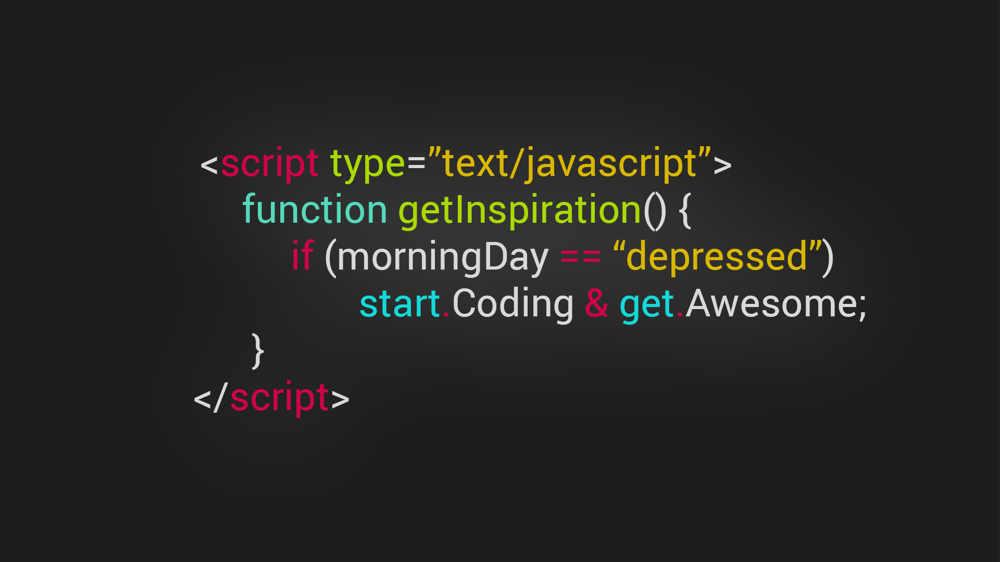

# Dia 11 (25/06/2024)

Este é o nosso décimo primeiro dia de conteúdo!

Hoje, vamos continuar nossa jornada no JavaScript explorando o conceito de funções. Veremos como definir funções, utilizá-las para organizar e reutilizar código, e também aprenderemos sobre funções anônimas, incluindo as arrow functions.

## O que será visto na aula de hoje

Funções:

- O que são funções e por que são importantes
- Como definir e chamar funções em JavaScript

Definindo Funções:

- Sintaxe básica para definição de funções
- Parâmetros e valores de retorno
- Exemplos de uso prático de funções

Funções Anônimas:

- O que são funções anônimas e como utilizá-las
- Introdução às arrow functions
- Comparação entre funções tradicionais e arrow functions

Objetivos da Aula:

- Compreender o conceito e a utilidade das funções em JavaScript
- Definir e utilizar funções corretamente em seu código
- Conhecer e aplicar funções anônimas e arrow functions
- Identificar as diferenças e vantagens das arrow functions em comparação com as funções tradicionais

Prepare-se para uma aula prática e interativa, onde aprofundaremos nosso conhecimento em JavaScript, focando na criação e utilização de funções para tornar nosso código mais modular e eficiente!

Uma função **é um procedimento de JavaScript - um conjunto de instruções que executa uma tarefa ou calcula um valor.**

Para usar uma função, você deve defini-la em algum lugar no escopo do qual você quiser chamá-la.



## O que são funções e por que são importantes

### Introdução

Funções são blocos de código que executam uma tarefa específica e podem ser reutilizados em diferentes partes do programa. Elas tornam o código mais modular, fácil de ler e de manter.

## Estrutura Básica de uma Função

A estrutura básica de uma função em JavaScript é composta por:

- **Declaração da função:** Onde definimos o nome e os parâmetros da função.
- **Corpo da função:** Onde escrevemos o código que será executado quando a função for chamada.
- **Retorno da função (opcional):** Usamos `return` para devolver um valor ao final da execução da função.

```js
function nomeDaFuncao(parametro1, parametro2) { // Código a ser executado return resultado; }
```

## Exemplo de Função de Boas-Vindas

Vamos criar uma função que exibe uma mensagem de boas-vindas para o usuário usando `document.write`.

```js
function boasVindas(nome) {
  document.write(`<h1>Bem-vindo(a), ${nome}!</h1>`);
} // Chamando a função com diferentes nomes boasVindas("Gleidson"); boasVindas("Márcio"); boasVindas("Alessandro"); boasVindas("Sarah");
```

## Parâmetros Undefined e Erro de Referência

Quando chamamos uma função sem fornecer os parâmetros necessários, o valor desses parâmetros será `undefined`. Um erro de referência ocorre quando tentamos acessar uma variável ou função que não foi definida.

### Exemplo de Undefined

```js
function exibirNome(nome) {
  document.write(`<h1>Nome: ${nome}</h1>`);
}
exibirNome(); // Nome será undefined
```

### Exemplo de Erro de Referência

```js
function exibirIdade(idade) {
  document.write(`<h1>Idade: ${idade}</h1>`);
} // Abaixo causará um erro de referência pois a função não foi chamada exibirIdade(30); // Correto
```

## Extensão Auto Close Tag no VSCode

Para facilitar a escrita de código HTML, é recomendado instalar a extensão `Auto Close Tag` no VSCode. Essa extensão automaticamente fecha as tags HTML, economizando tempo e reduzindo erros.

## Função Somar

Vamos criar uma função que soma dois números e exibe o resultado na tela do usuário usando `document.write`.

```js
function somar(numero1, numero2) {
  let resultado = numero1 + numero2;
  return resultado;
}
let resultadoSoma = somar(10, 20);
document.write(`<h1>O resultado da soma é: ${resultadoSoma}</h1>`);
```

O `return` é utilizado para devolver o valor calculado pela função. No exemplo acima, `return` `resultado`; retorna a soma de `numero1` e `numero2`.

## Funções Mutáveis e Estáticas

- **Funções Mutáveis:** Podem modificar o estado de variáveis fora do seu escopo ou serem reatribuídas.
- **Funções Estáticas:** São funções cujas operações não afetam o estado de outras variáveis fora de seu escopo.

### Exemplo de Função Mutável

```js
let contador = 0;
function incrementar() {
  contador++;
}
incrementar();
document.write(`<h1>Contador: ${contador}</h1>`); // Contador: 1
```

### Exemplo de Função Estáticas

```js
function calcularDobro(num) {
  return num * 2;
}
let valor = 5;
let dobro = calcularDobro(valor);
document.write(`<h1>Dobro de ${valor} é: ${dobro}</h1>`); // Dobro de 5 é: 10
```

## Funções para Preencher Selects

Vamos criar uma função para preencher elementos `select` em HTML com dias e meses.

### HTML para Selects

```html
<select id="dia"></select>
<select id="mes"></select>
```

### Função para Preencher Selects

```js
function preencherSelect(tag, limite) {
  for (let i = 1; i < limite; i++) {
    tag.innerHTML += `<option>${i}</option>`;
  }
}
let dia = document.getElementById("dia");
let mes = document.getElementById("mes");
preencherSelect(dia, 32); // Preenche o select de dias (1 a 31) preencherSelect(mes, 13); // Preenche o select de meses (1 a 12)
```

**Conclusão:**

Funções são uma parte fundamental da programação em JavaScript, permitindo modularidade e reutilização de código. Elas podem receber parâmetros, retornar valores e manipular variáveis. Compreender como criar e usar funções eficientemente é crucial para escrever código limpo e eficiente. Instalar extensões como Auto Close Tag no VSCode pode melhorar significativamente sua produtividade ao escrever código HTML.

## Roteiro sobre Funções em JavaScript

## Objetivos da Aula

- Compreender o conceito e a utilidade das funções em JavaScript.
- Definir e utilizar funções corretamente em seu código.
- Conhecer e aplicar funções anônimas e arrow functions.
- Identificar as diferenças e vantagens das arrow functions em comparação com as funções tradicionais.

**O que são funções e por que são importantes:**

- **Funções:** São blocos de código reutilizáveis que realizam uma tarefa específica. Podem receber dados de entrada (parâmetros) e retornar um resultado.

### Importância

- **Modularidade:** Permite dividir um programa em partes menores e mais gerenciáveis.
- **Reutilização:** Evita a repetição de código, permitindo a reutilização de funções em diferentes partes do programa.
- **Organização:** Melhora a legibilidade e manutenção do código, facilitando o entendimento e a depuração.

## Como definir e chamar funções em JavaScript

### Definição de Funções

- A definição de uma função envolve especificar o nome da função, os parâmetros (se houver) e o bloco de código que será executado.

### Sintaxe Básica

```js
function nomeDaFuncao(param1, param2) { // Bloco de código a ser executado return resultado; }
```

### Chamada de Funções

Para executar uma função, chamamos seu nome seguido de parênteses, passando os argumentos necessários.

```js
nomeDaFuncao(valor1, valor2);
```

## Definindo Funções

### Sintaxe Básica para Definição de Funções

Funções são definidas usando a palavra-chave `function`, seguida pelo nome da função, lista de parâmetros entre parênteses e um bloco de código entre chaves.

### Parâmetros e Valores de Retorno

- **Parâmetros:** São valores que você pode passar para a função para que ela os utilize em seu processamento.
- **Valor de Retorno:** O valor que a função devolve após a execução, utilizando a palavra-chave return.

**Exemplo Prático:**

```js
function somar(a, b) {
  return a + b;
}

let resultado = somar(5, 3);
console.log(resultado); // 8
```

## Funções Anônimas

- **Funções Anônimas:** Funções sem nome, geralmente usadas como argumentos para outras funções ou atribuídas a variáveis.

### Utilização

- As funções anônimas são frequentemente usadas em callbacks e funções de ordem superior.

### Exemplo

```js
let saudacao = function (nome) {
  return "Olá, " + nome;
};

console.log(saudacao("João")); // "Olá, João"
```

## Introdução às Arrow Functions

- **Arrow Functions:** Uma forma mais concisa de escrever funções anônimas, introduzida no ES6.

```js
const nomeDaFuncao = (param1, param2) => {
  return resultado;
};
```

### Comparação

- **Funções Tradicionais:**

```js
function somar(a, b) {
  return a + b;
}
```

- **Arrow Functions:**

```js
const somar = (a, b) => a + b;
```

## Comparação entre Funções Tradicionais e Arrow Functions

### Diferenças

- **Sintaxe:** Arrow functions têm uma sintaxe mais curta e limpa.
- `this` **Contexto:** Arrow functions não têm seu próprio this, elas herdam o this do contexto em que foram definidas, o que pode evitar certos erros de escopo.

### Vantagens das Arrow Functions

- **Concisão:** Código mais curto e legível.
- **Contexto Léxico:** O `this` dentro de uma arrow function é o mesmo `this` do contexto em que a função foi definida, facilitando o uso em métodos de objetos e callbacks.

## Exemplo Comparativo

```js
// Função Tradicional
function Pessoa() {
  this.idade = 0;

  setInterval(function () {
    this.idade++;
    console.log(this.idade); // `this` refere-se ao objeto global, não ao objeto Pessoa
  }, 1000);
}

// Usando Arrow Function
function Pessoa() {
  this.idade = 0;

  setInterval(() => {
    this.idade++;
    console.log(this.idade); // `this` refere-se ao objeto Pessoa
  }, 1000);
}
```

**Conclusão:**

- Funções são fundamentais em JavaScript para modularizar, reutilizar e organizar o código.
- Saber definir e utilizar funções corretamente melhora a eficiência e a legibilidade do seu código.
- Funções anônimas e arrow functions são ferramentas poderosas que, quando bem compreendidas, podem simplificar e tornar o código mais eficiente.

## Introdução aos Objetos

**Introdução aos Objetos:**

Objetos são estruturas de dados que permitem armazenar coleções de pares chave-valor. Eles são usados para representar entidades do mundo real e suas características em um formato estruturado e acessível.

### Diferença entre Objetos e Arrays

- **Objetos:** Utilizam pares chave-valor para armazenar dados. Cada valor é acessado através de sua chave.
- **Arrays:** São listas ordenadas de valores, acessados através de índices numéricos.

**Exemplo Prático:**

Vamos criar um objeto para representar uma pessoa com as propriedades nome, idade, gênero e habilidades.

```js
let pessoa = {
  nome: "Gleidson",
  idade: 30,
  genero: "masculino",
  habilidades: ["JavaScript", "HTML", "CSS"],
}; // Acessando as propriedades do objeto console.log(pessoa.nome); // Gleidson console.log(pessoa.idade); // 30 console.log(pessoa.genero); // masculino console.log(pessoa.habilidades); // ["JavaScript", "HTML", "CSS"]
```

### Chave (key) e Valor (value)

Em um objeto, cada entrada é um par chave-valor:

- **Chave (key):** Nome do campo, que deve ser único dentro do objeto.
- **Valor (value):** Dado associado à chave, que pode ser de qualquer tipo (string, número, array, função, etc.).

```js
let carro = { marca: "Toyota", // Chave: marca, Valor: "Toyota" modelo: "Corolla", // Chave: modelo, Valor: "Corolla" ano: 2021 // Chave: ano, Valor: 2021 };
```

**Funções Anônimas:**

Funções anônimas são funções sem nome que são geralmente usadas como argumentos para outras funções ou atribuídas a variáveis.

### Exemplo de Função Anônima Guardada em uma Variável

```js
let saudacao = function (nome) {
  return `Olá, ${nome}!`;
};
console.log(saudacao("Márcio")); // Olá, Márcio!
```

### Arrow Functions

Arrow functions são uma sintaxe mais curta para escrever funções anônimas introduzida no ECMAScript 6. Elas não possuem seus próprios `this` e `arguments`, o que pode ser útil em certos contextos.

### Sintaxe de Arrow Function

```js
// Função tradicional function somar(a, b) { return a + b; } // Arrow function let somar = (a, b) => a + b; console.log(somar(10, 20)); // 30
```

### Exemplo Completo de Objeto e Funções

Vamos expandir nosso exemplo de objeto `pessoa` para incluir métodos que usam funções anônimas e arrow functions.

```js
let pessoa = {
  nome: "Alessandro",
  idade: 25,
  genero: "masculino",
  habilidades: ["JavaScript", "HTML", "CSS"],
  saudacao: function () {
    return `Olá, meu nome é ${this.nome} e eu tenho ${this.idade} anos.`;
  },
  adicionarHabilidade: function (habilidade) {
    this.habilidades.push(habilidade);
  },
  listarHabilidades: () => {
    console.log("Minhas habilidades são: " + pessoa.habilidades.join(", "));
  },
};
console.log(pessoa.saudacao()); // Olá, meu nome é Alessandro e eu tenho 25 anos. pessoa.adicionarHabilidade("Node.js"); pessoa.listarHabilidades(); // Minhas habilidades são: JavaScript, HTML, CSS, Node.js
```

### Função para Preencher Selects no HTML

Vamos criar uma função para preencher elementos select em HTML com dias e meses.

**HTML para Selects:**

```html
<select id="dia"></select>
<select id="mes"></select>
```

**Função para Preencher Selects:**

```js
function preencherSelect(tag, limite) {
  for (let i = 1; i < limite; i++) {
    tag.innerHTML += `<option>${i}</option>`;
  }
}
let dia = document.getElementById("dia");
let mes = document.getElementById("mes");
preencherSelect(dia, 32); // Preenche o select de dias (1 a 31) preencherSelect(mes, 13); // Preenche o select de meses (1 a 12)
```

**Conclusão:**

Objetos são fundamentais em JavaScript para organizar e manipular dados de forma estruturada. Eles permitem associar chaves a valores, facilitando o acesso e a manipulação de informações complexas. Funções anônimas e arrow functions proporcionam formas flexíveis e concisas de definir comportamento no código. Compreender essas estruturas e conceitos é essencial para desenvolver aplicações eficientes e manuteníveis.

### Aula sobre Document Object Model (DOM) e Web Storage em JavaScript

#### O Objeto `document`

O objeto `document` é a representação do documento HTML carregado no navegador. Ele é a principal interface para acessar e manipular o conteúdo e a estrutura da página web. Através do objeto `document`, podemos modificar elementos HTML, criar novos elementos, ouvir eventos, entre outras ações.

#### A Função `document.write`

A função `document.write` permite escrever texto diretamente no documento HTML. É uma maneira simples de inserir conteúdo durante o carregamento da página, mas deve ser usada com cuidado, pois pode sobrescrever o conteúdo existente se utilizada após o carregamento completo do documento.

```js
document.write("<h1>Bem-vindo ao nosso site!</h1>");
```

### Propriedades em Caixa Alta e Caixa Baixa

Em JavaScript, é importante notar a distinção entre maiúsculas e minúsculas, pois as propriedades e métodos são sensíveis a essa diferenciação.

#### Exemplos de Propriedades

- **Caixa Alta:** ELEMENT_NODE
- **Caixa Baixa:** innerHTML, getElementById

```js
let elemento = document.getElementById("meuElemento");
elemento.innerHTML = "Texto atualizado";
console.log(document.ELEMENT_NODE); // 1
```

### Web Storage: Local Storage

O `localStorage` é uma das formas de armazenamento fornecidas pelo Web Storage API. Ele permite armazenar dados no navegador de maneira persistente (os dados permanecem mesmo após o fechamento do navegador).

#### Armazenando Dados com `localStorage.setItem`

O método `setItem` armazena um item no `localStorage` com um par chave-valor.

```js
localStorage.setItem("nome", "Gleidson");
```

#### Recuperando Dados com `localStorage.getItem`

O método `getItem` recupera o valor associado a uma chave no `localStorage`.

```js
let nome = localStorage.getItem("nome");
console.log(nome); // Gleidson
```

#### `setInterval`

A função `setInterval` executa uma função ou um trecho de código repetidamente, em um intervalo especificado de tempo (em milissegundos).

#### Exemplo de setInterval

```js
function mostrarHora() {
  let agora = new Date();
  document.getElementById("relogio").innerHTML = agora.toLocaleTimeString();
} // Atualiza o relógio a cada segundo (1000 milissegundos) setInterval(mostrarHora, 1000);
```

### Documentação MDN Web Docs

O MDN Web Docs (Mozilla Developer Network) é uma das principais fontes de referência para desenvolvedores web. Ele fornece documentação detalhada, exemplos e tutoriais sobre HTML, CSS, JavaScript e outras tecnologias web. O site é amplamente utilizado por desenvolvedores para obter informações precisas e atualizadas sobre a web.

Link para a Documentação MDN [Clique aqui](https://developer.mozilla.org/pt-BR/)

**Conclusão:**

Nesta aula, aprendemos sobre o objeto `document` e suas funcionalidades, incluindo a função `document.write` e a importância da sensibilidade a maiúsculas e minúsculas em JavaScript. Exploramos o `localStorage` para armazenamento persistente de dados no navegador e vimos como utilizar `setInterval` para executar funções em intervalos regulares. Por fim, destacamos a importância da documentação MDN Web Docs como recurso essencial para desenvolvedores web. Com essas ferramentas e conhecimentos, você estará mais preparado para manipular o DOM e gerenciar dados no navegador de forma eficiente.
