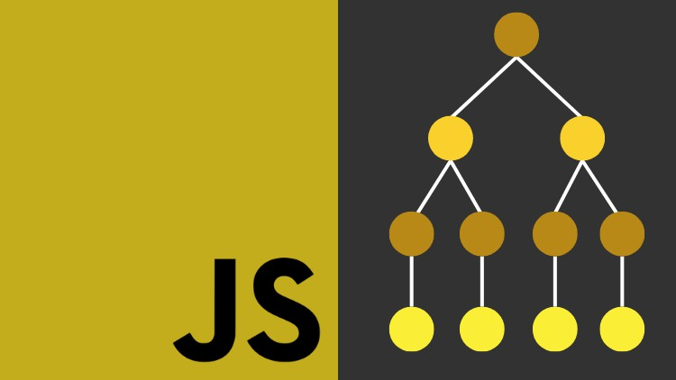

# Dia 13 (27/06/2024)

## Este é o nosso décimo terceiro dia de conteúdo

Hoje, vamos explorar as estruturas de repetição em JavaScript. Veremos como utilizar as instruções `for`, `while` e `do/while` para executar blocos de código várias vezes de forma eficiente.

## O que será visto na aula de hoje

### Arrays

- **Introdução aos Arrays:** Estruturas que permitem armazenar múltiplos valores em uma única variável.
- **Manipulação de Arrays:** Como adicionar, remover e acessar elementos de um array.
- **Métodos de Arrays:** Principais métodos, como push, pop, shift, unshift, forEach, map e filter.

### Estruturas de Repetição em JavaScript

- **Introdução às Estruturas de Repetição:** Importância de repetir ações no código para automatizar tarefas repetitivas.
- **for:**

  - **Sintaxe básica da instrução for:** Inicialização, condição e incremento.
  - **Como configurar e controlar loops for:** Utilizando variáveis de controle e limites.
  - **Exemplos práticos de uso:** Iterar sobre arrays e modificar seus elementos.

- **while:**

  - **Sintaxe básica da instrução while:** Condição e execução do bloco de código enquanto a condição for verdadeira.
  - **Diferenças entre for e while:** Quando usar cada um dos loops.
  - **Exemplos práticos de uso:** Loops baseados em condições que podem não ter um número fixo de iterações.

- **do/while:**
  - **Sintaxe básica da instrução do/while:** Execução do bloco de código pelo menos uma vez antes de verificar a condição.
  - **Quando usar do/while em vez de while:** Situações onde o código deve ser executado pelo menos uma vez.
  - **Exemplos práticos de uso:** Cenários onde a validação de condição ocorre após a execução do bloco de código.

### Exercício Prático de Estruturas de Repetição em JavaScript

- **Formulários Dinâmicos:** Utilizando loops para preencher selects de dia, mês e ano dinamicamente.
- **Arrays e Repetição:** Aplicando estruturas de repetição para manipular arrays e preencher campos do formulário.
- **Implementação Prática:**
  - Preenchendo selects de dia: Usando um loop for para adicionar opções de dias.
  - Preenchendo selects de mês: Utilizando um array para os nomes dos meses e um loop for.
  - Preenchendo selects de ano: Criando um loop for que decrementa a partir do ano atual.

## Objetivos da Aula

- **Compreender a importância das estruturas de repetição em JavaScript:** Como elas podem tornar o código mais eficiente e modular.
- **Utilizar `for` para criar loops controlados:** Entender a sintaxe e aplicar em diferentes contextos.
- **Aplicar `while` para loops baseados em condições:** Reconhecer situações onde `while` é mais adequado.
- **Implementar `do/while` para situações onde o bloco de código deve ser executado pelo menos uma vez:** Garantir a execução inicial do bloco antes da verificação da condição.
- **Praticar a implementação de estruturas de repetição em exemplos práticos:** Consolidar o conhecimento com exercícios práticos e aplicáveis.

Prepare-se para uma aula dinâmica e desafiadora, onde exploraremos como tornar nosso código mais eficiente utilizando estruturas de repetição e arrays em JavaScript!

## Estrutura de Dados: Arrays em JavaScript

As estruturas de repetição são fundamentais em programação, permitindo que blocos de código sejam executados várias vezes de acordo com uma condição especificada.

Em JavaScript, as principais estruturas de repetição são `for`, `while` e `do/while`.

Elas são usadas para iterar sobre arrays, executar tarefas repetidas e simplificar o código que necessita de repetição.



**Arrays:**

Olá, desenvolvedores! Continuando nosso tema sobre JavaScript, hoje vamos falar sobre mais uma estrutura de dados. Nos primeiros vídeos, discutimos três estruturas básicas: String, Number e Boolean, que representam texto, números e valores verdadeiros ou falsos, respectivamente. Mas existem outras estruturas de dados importantes que precisamos conhecer. Hoje, vamos aprender sobre Arrays.

## Problema com Múltiplas Variáveis

Imagine que você precise guardar vários nomes em variáveis. Inicialmente, você poderia fazer algo assim:

```js
let nome1 = "Gleidson";
let nome2 = "Márcio";
let nome3 = "Alessandro";
let nome4 = "Glauber";
```

Embora isso funcione, não é uma solução eficiente, especialmente se você tiver muitos nomes para armazenar. Manter várias variáveis torna o código mais complexo e difícil de gerenciar.

## Solução com Arrays

Um `Array` é uma estrutura de dados que permite armazenar múltiplos valores em uma única variável. Vamos ver como criar e usar `Arrays` em JavaScript.

## Criando um Array

Podemos criar um `Array` vazio assim:

```js
let nomes = [];
```

Ou um Array`` com valores:

```js
let nomes = ["Gleidson", "Márcio", "Alessandro", "Glauber"];
```

## Acessando Elementos de um Array

Cada elemento em um `Array` tem um índice, que começa em 0. Para acessar os elementos, usamos o nome do `Array` seguido do índice entre colchetes.

```js
console.log(nomes[0]); // Gleidson console.log(nomes[2]); // Alessandro
```

## Adicionando Elementos ao Array

Podemos adicionar elementos a um `Array` de várias maneiras. Uma delas é usando o método `push`.

```js
nomes.push("João");
console.log(nomes); // ["Gleidson", "Márcio", "Alessandro", "Glauber", "João"]
```

## Modificando Elementos do Array

Para modificar um elemento do `Array`, basta acessar o índice e atribuir um novo valor.

```js
nomes[1] = "Marcos";
console.log(nomes); // ["Gleidson", "Marcos", "Alessandro", "Glauber", "João"]
```

## Removendo Elementos do Array

Para remover elementos, podemos usar o método `splice`.

```js
nomes.splice(2, 1); // Remove o terceiro elemento (índice 2) console.log(nomes); // ["Gleidson", "Marcos", "Glauber", "João"]
```

## Arrays e Índices

Os índices são essenciais para acessar e manipular elementos em um `Array`. Cada elemento possui uma posição específica, começando do 0 até o tamanho do `Array` menos um.

**Exemplo Prático:**

Vamos criar um `Array` de nomes e acessá-los pelo índice:

```js
let nomes = ["Gleidson", "Márcio", "Alessandro", "Glauber"];
console.log(nomes[0]); // Gleidson console.log(nomes[2]); // Alessandro nomes.push("João"); console.log(nomes); // ["Gleidson", "Márcio", "Alessandro", "Glauber", "João"] nomes[1] = "Marcos"; console.log(nomes); // ["Gleidson", "Marcos", "Alessandro", "Glauber", "João"] nomes.splice(2, 1); console.log(nomes); // ["Gleidson", "Marcos", "Glauber", "João"]
```

**Conclusão:**

Os `Arrays` são uma poderosa estrutura de dados em JavaScript que permitem armazenar e manipular múltiplos valores de maneira eficiente. Com `Arrays`, seu código se torna mais organizado e fácil de manter. Use-os sempre que precisar lidar com listas de dados.

Espero que essa aula tenha ajudado a entender como utilizar `Arrays` em seus códigos JavaScript. Vejo vocês no próximo encontro para continuar nosso aprendizado!

## Estruturas de Repetição

Continuando nosso aprendizado sobre JavaScript, hoje vamos explorar as estruturas de repetição. Até agora, vimos as estruturas condicionais if, else `if`, `else`, `switch case` e o operador ternário. As estruturas de repetição permitem executar um bloco de código várias vezes, o que é extremamente útil quando precisamos realizar tarefas repetitivas.

## `for`

A estrutura `for` é uma das mais comuns em JavaScript. Ela é usada quando sabemos com antecedência quantas vezes queremos repetir um bloco de código.

## Sintaxe do `for`

```js
for (inicialização; condição; incremento) { // Código a ser executado }
```

- **inicialização:** Define a variável de controle do laço e seu valor inicial.
- **condição:** Testa a condição para continuar executando o laço.
- **incremento:** Atualiza a variável de controle a cada iteração.

**Exemplo Prático:**

Vamos criar um array de números e incrementar cada valor em 1.

```js
let numeros = [1, 2, 3, 4, 5];
for (let i = 0; i < numeros.length; i++) {
  numeros[i] += 1;
}
console.log(numeros); // [2, 3, 4, 5, 6]
```

Neste exemplo:

1. Inicializamos `i` com 0.
2. A condição `i < numeros.length` garante que o laço será executado enquanto `i` for menor que o comprimento do array.
3. O `i++` incrementa `i` em 1 a cada iteração.

## Cuidados com Laços Infinitos

É importante garantir que o laço tenha uma condição de parada para evitar laços infinitos, que podem travar o navegador ou a aplicação.

```js
for (let i = 0; i < numeros.length; i++) { console.log(i); // Certifique-se de que a condição de parada será alcançada }
```

## Usando `for` com Arrays

Podemos usar a estrutura `for` para iterar sobre arrays e modificar seus elementos de maneira eficiente.

```js
let numeros = [1, 2, 3, 4, 5];
for (let i = 0; i < numeros.length; i++) {
  numeros[i] += 1;
}
console.log(numeros); // [2, 3, 4, 5, 6]
```

**Exemplo Completo:**

Vamos ver um exemplo completo onde utilizamos um for para percorrer um array e incrementar cada valor em 2.

```js
let numeros = [1, 2, 3, 4, 5];
for (let i = 0; i < numeros.length; i++) {
  numeros[i] += 2;
}
console.log(numeros); // [3, 4, 5, 6, 7]
```

## Estruturas de Repetição Adicionais

Além do `for`, existem outras estruturas de repetição que você deve conhecer:

### `while`

O laço `while` executa um bloco de código enquanto a condição especificada for verdadeira.

### Sintaxe do `while`

```js
while (condição) { // Código a ser executado }
```

### Exemplo de `while`

```js
let i = 0;
while (i < 5) {
  console.log(i);
  i++;
}
```

### `do...while`

O laço `do...while` é semelhante ao while, mas garante que o bloco de código será executado pelo menos uma vez.

### Sintaxe do `do...while`

```js
do { // Código a ser executado } while (condição);
```

### Exemplo de `do...while`

```js
let i = 0;
do {
  console.log(i);
  i++;
} while (i < 5);
```

**Conclusão:**

As estruturas de repetição são fundamentais para automatizar tarefas repetitivas em JavaScript. A estrutura `for` é uma das mais usadas e versáteis, permitindo iterar sobre arrays e executar blocos de código múltiplas vezes de forma eficiente. Compreender e utilizar corretamente essas estruturas é essencial para desenvolver programas robustos e eficientes.

Espero que essa aula tenha ajudado a entender como utilizar estruturas de repetição em seus códigos JavaScript. Vejo vocês no próximo encontro para continuar nosso aprendizado!

**Exercício Prático de Estruturas de Repetição em JavaScript:**

Olá, pessoal! Continuando nosso aprendizado em JavaScript, vamos colocar em prática tudo o que aprendemos sobre estruturas condicionais, de repetição e arrays. Nosso objetivo hoje é criar um formulário que permita selecionar uma data (dia, mês e ano) dinamicamente utilizando JavaScript.

## Estrutura HTML Básica

Vamos começar criando uma estrutura HTML básica para o nosso formulário:

```html
<!DOCTYPE html>
<html lang="pt-br">
  <head>
    <meta charset="UTF-8" />
    <title>Formulário de Data</title>
    <script src="script.js" defer></script>
  </head>
  <body>
    <form>
      <label for="dia">Dia:</label>
      <select id="dia"></select>
      <label for="mes">Mês:</label>
      <select id="mes"></select>
      <label for="ano">Ano:</label>
      <select id="ano"></select>
    </form>
  </body>
</html>
```

## Preenchendo os Campos com JavaScript

Vamos preencher os campos `select` de dia, mês e ano usando JavaScript.

## Preenchendo os Dias

Vamos criar um laço de repetição para preencher os dias do mês:

```js
let diaSelect = document.getElementById("dia");
for (let dia = 1; dia <= 31; dia++) {
  let option = document.createElement("option");
  option.value = dia;
  option.textContent = dia;
  diaSelect.appendChild(option);
}
```

## Preenchendo os Meses

Para os meses, vamos usar um array para armazenar os nomes dos meses:

```js
let mesSelect = document.getElementById('mes'); let meses = ["Janeiro", "Fevereiro", "Março", "Abril", "Maio", "Junho", "Julho", "Agosto", "Setembro", "Outubro", "Novembro", "Dezembro"]; for (let i = 0; i < meses.length; i++) { let option = document.createElement('option'); option.value = i + 1; // Os meses começam em 1 option.textContent = meses[i]; mesSelect.appendChild(option); }
```

## Preenchendo os Anos

Vamos preencher os anos partindo do ano atual até 50 anos atrás:

```js
let anoSelect = document.getElementById("ano");
let anoAtual = new Date().getFullYear();
for (let ano = anoAtual; ano >= anoAtual - 50; ano--) {
  let option = document.createElement("option");
  option.value = ano;
  option.textContent = ano;
  anoSelect.appendChild(option);
}
```

## Código JavaScript Completo

Aqui está o código JavaScript completo para preencher os campos `select` de dia, mês e ano:

```js
document.addEventListener('DOMContentLoaded', () => { // Preencher dias let diaSelect = document.getElementById('dia'); for (let dia = 1; dia <= 31; dia++) { let option = document.createElement('option'); option.value = dia; option.textContent = dia; diaSelect.appendChild(option); } // Preencher meses let mesSelect = document.getElementById('mes'); let meses = ["Janeiro", "Fevereiro", "Março", "Abril", "Maio", "Junho", "Julho", "Agosto", "Setembro", "Outubro", "Novembro", "Dezembro"]; for (let i = 0; i < meses.length; i++) { let option = document.createElement('option'); option.value = i + 1; // Os meses começam em 1 option.textContent = meses[i]; mesSelect.appendChild(option); } // Preencher anos let anoSelect = document.getElementById('ano'); let anoAtual = new Date().getFullYear(); for (let ano = anoAtual; ano >= anoAtual - 50; ano--) { let option = document.createElement('option'); option.value = ano; option.textContent = ano; anoSelect.appendChild(option); } });
```

**Conclusão:**

Neste exercício, utilizamos estruturas de repetição para preencher dinamicamente os campos `select` de um formulário HTML com dias, meses e anos. Este tipo de interação entre HTML e JavaScript é fundamental para criar aplicações web dinâmicas e responsivas. Pratiquem bastante e explorem novas possibilidades!

Vejo vocês no próximo encontro para continuar nosso aprendizado! Valeu, pessoal!
