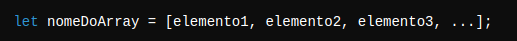
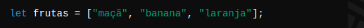
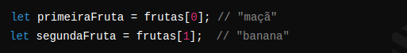
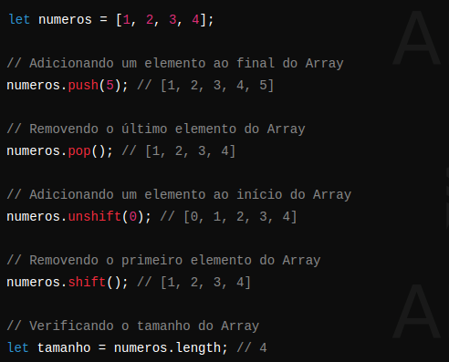
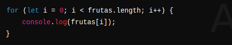
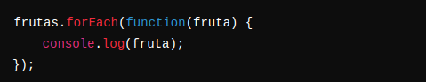
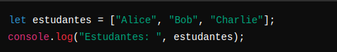
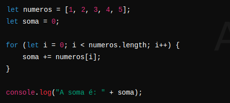
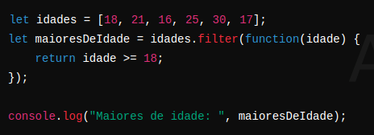

# Dia 14 (28/06/2024)

Este é o nosso décimo quarto dia de conteúdo!

Hoje, teremos uma aula síncrona de JavaScript. Vamos revisar os conceitos que aprendemos até agora e tirar dúvidas em tempo real. Além disso, vamos focar no uso de arrays em JavaScript, entendendo como eles funcionam e como podemos utilizá-los em nossos programas.

## O que será visto na aula de hoje

**Aula Síncrona de JavaScript:**

- Revisão dos conceitos fundamentais de JavaScript
- Sessão de perguntas e respostas para tirar dúvidas

**Arrays em JavaScript:**

- Introdução aos arrays e sua importância
  Como declarar e inicializar arrays
- Métodos e operações comuns em arrays

## Objetivos da Aula

- Relembrar e consolidar os conceitos de JavaScript estudados até agora
- Compreender o funcionamento dos arrays e suas aplicações
- Praticar a manipulação de arrays utilizando métodos e operações básicas

Prepare-se para uma aula interativa e colaborativa, onde reforçaremos nosso conhecimento de JavaScript e aprenderemos a utilizar arrays de forma eficaz!

**Aula Síncrona de JavaScript:**

Bem-vindos à nossa 14ª aula síncrona de JavaScript! Hoje, vamos aprofundar nossos conhecimentos em um dos conceitos mais essenciais da linguagem: os Arrays.

Vamos explorar suas definições, usos, e exemplos práticos que irão ajudar você a compreender como manipular coleções de dados de maneira eficiente.

## Arrays

### Introdução aos Arrays

Os Arrays em JavaScript são estruturas de dados que permitem armazenar múltiplos valores em uma única variável. Eles são extremamente úteis para organizar e manipular conjuntos de dados de forma ordenada.

**Definição de Arrays:**

Um Array é uma coleção ordenada de elementos, onde cada elemento é identificado por um índice. Em JavaScript, os Arrays podem armazenar diferentes tipos de dados, como números, strings, objetos e até outros Arrays.

**Sintaxe para Declaração de um Array:**

A sintaxe básica para declarar um Array em JavaScript é:



**Exemplo de Declaração de um Array:**



### Acessando Elementos de um Array

Os elementos de um Array podem ser acessados utilizando o índice do elemento, que começa em 0.

Exemplo



**Métodos Comuns de Arrays:**

JavaScript oferece diversos métodos integrados para manipulação de Arrays. Alguns dos métodos mais comuns incluem:

- **push():** Adiciona um ou mais elementos ao final do Array.
- **pop():** Remove o último elemento do Array.
- **shift():** Remove o primeiro elemento do Array.
- **unshift():** Adiciona um ou mais elementos ao início do Array.
- **length:** Retorna o número de elementos no Array.

**Exemplo de Métodos de Arrays:**



**Iterando Sobre Arrays:**

Para iterar sobre os elementos de um Array, podemos usar loops como `for`, `forEach`, `for...of` entre outros.

**Exemplo de Iteração com `for`:**



#### Exemplo de Iteração com forEach



**Exemplos Práticos de Uso de Arrays:**

### Exemplo 1: Armazenando Nomes de Estudantes



**Aula Síncrona de JavaScript:**

Bem-vindos à nossa 14ª aula síncrona de JavaScript! Hoje, vamos aprofundar nossos conhecimentos em um dos conceitos mais essenciais da linguagem: os Arrays. Vamos explorar suas definições, usos, e exemplos práticos que irão ajudar você a compreender como manipular coleções de dados de maneira eficiente.

## JavaScript: Arrays

Os Arrays em JavaScript são estruturas de dados que permitem armazenar múltiplos valores em uma única variável. Eles são extremamente úteis para organizar e manipular conjuntos de dados de forma ordenada.

**Definição de Arrays:**

Um Array é uma coleção ordenada de elementos, onde cada elemento é identificado por um índice. Em JavaScript, os Arrays podem armazenar diferentes tipos de dados, como números, strings, objetos e até outros Arrays.

**Sintaxe para Declaração de um Array:**

A sintaxe básica para declarar um Array em JavaScript é:

```js
let nomeDoArray = [elemento1, elemento2, elemento3, ...];
```

**Exemplo de Declaração de um Array:**

**Exemplo:**

```js
let primeiraFruta = frutas[0]; // "maçã" let segundaFruta = frutas[1]; // "banana"
```

**Métodos Comuns de Arrays:**

JavaScript oferece diversos métodos integrados para manipulação de Arrays. Alguns dos métodos mais comuns incluem:

- **push():** Adiciona um ou mais elementos ao final do Array.
- **pop():** Remove o último elemento do Array.
- **shift():** Remove o primeiro elemento do Array.
- **unshift():** Adiciona um ou mais elementos ao início do Array.
- **length:** Retorna o número de elementos no Array.

**Exemplo de Métodos de Arrays:**

```js
let numeros = [1, 2, 3, 4]; // Adicionando um elemento ao final do Array numeros.push(5); // [1, 2, 3, 4, 5] // Removendo o último elemento do Array numeros.pop(); // [1, 2, 3, 4] // Adicionando um elemento ao início do Array numeros.unshift(0); // [0, 1, 2, 3, 4] // Removendo o primeiro elemento do Array numeros.shift(); // [1, 2, 3, 4] // Verificando o tamanho do Array let tamanho = numeros.length; // 4
```

**Iterando Sobre Arrays:**

Para iterar sobre os elementos de um Array, podemos usar loops como `for`, `forEach`, `for...of` entre outros.

**Iterando Sobre Arrays:**

Para iterar sobre os elementos de um Array, podemos usar loops como `for`, `forEach`, `for...of` entre outros.

```js
for (let i = 0; i < frutas.length; i++) {
  console.log(frutas[i]);
}
```

**Exemplo de Iteração com `forEach`:**

```js
frutas.forEach(function (fruta) {
  console.log(fruta);
});
```

**Exemplos Práticos de Uso de Arrays:**

```js
let estudantes = ["Alice", "Bob", "Charlie"];
console.log("Estudantes: ", estudantes);
```

### Exemplo 2: Somando Números em um Array



### Exemplo 3: Filtrando Elementos de um Array



**Conclusão:**

Os Arrays são uma parte essencial do JavaScript, permitindo a manipulação e organização de conjuntos de dados de maneira eficiente. Compreender como criar, acessar, modificar e iterar sobre Arrays é crucial para qualquer desenvolvedor JavaScript. Durante nossa aula síncrona, vamos praticar esses conceitos e explorar mais exemplos para fortalecer seu entendimento.

Prepare suas dúvidas e vamos nos aprofundar no mundo dos Arrays em JavaScript!
