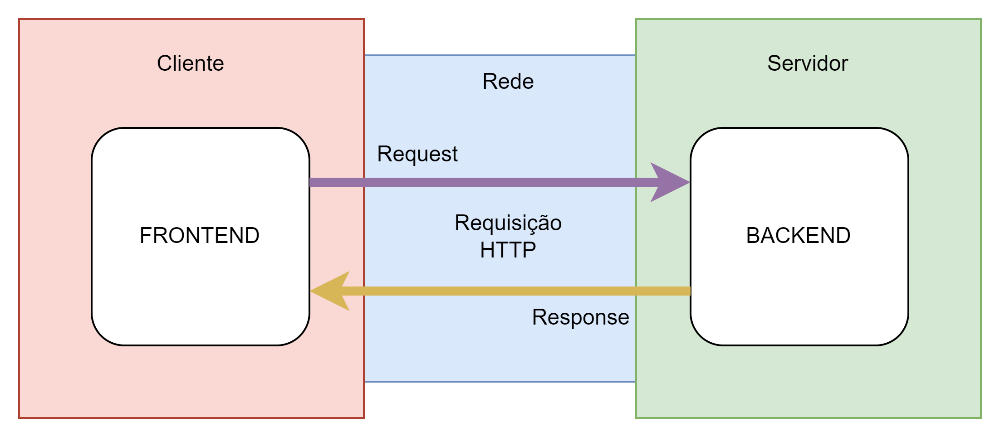
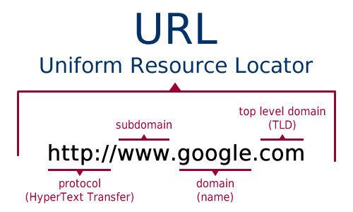
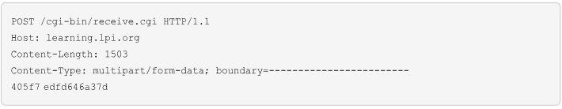
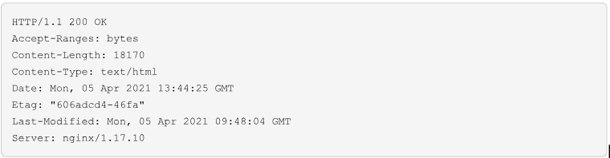
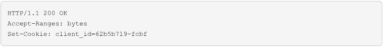
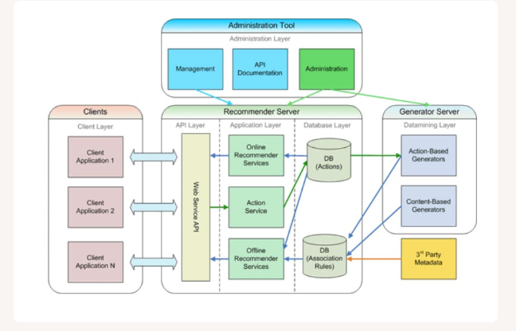
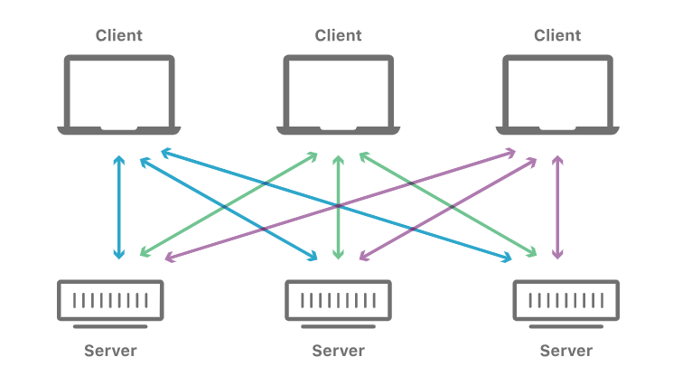

# Dia 01 (11/06/2024)

Este é o nosso primeiro dia de conteúdo!

Hoje seus estudos levarão a você a responder a seguinte pergunta: O que é Desenvolvimento Web?

Para responder a essa pergunta será necessário entender o que é a Web, como ela é organizada e que tipos de aplicações podemos construir nela.

É esperado que, ao final, você seja capaz de:

- Explicar o que é Desenvolvimento Web
- Definir os componentes de hardware e software que compõe a Web
- Elencar as atividades que uma pessoa desenvolvedora Web realiza no dia a dia

## Introdução ao Desenvolvimento

### A vida Pré-Internet

### Introdução ao TCP/IP

Para que os computadores de uma rede possam trocar informações entre si é necessário que todos os computadores adotem as mesmas regras para o envio e o recebimento de informações. Este conjunto de regras é conhecido como Protocolo de comunicação. Falando de outra maneira podemos afirmar: “Para que os computadores de uma rede possam trocar informações entre si é necessário que todos estejam utilizando o mesmo protocolo de comunicação”.

No protocolo de comunicação estão definidas todas as regras necessárias para que o computador de destino, “entenda” as informações no formato que foram enviadas pelo computador de origem. Dois computadores com diferentes protocolos instalados, não serão capazes de estabelecer uma comunicação e nem serão capazes de trocar informações.

Antes da popularização da Internet existiam diferentes protocolos sendo utilizados nas redes das empresas. Os mais utilizados eram os seguintes:

- TCP/IP
- NETBEUI
- IPX/SPX
- Apple Talk

Se colocarmos dois computadores ligados em rede, um com um protocolo, por exemplo o TCP/IP e o outro com um protocolo diferente, por exemplo NETBEUI, estes dois computadores não serão capazes de estabelecer comunicação e trocar informações entre si. Por exemplo, o computador com o protocolo NETBEUI instalado, não será capaz de acessar uma pasta ou uma Impressora compartilhada no computador com o protocolo TCP/IP instalado.

### Configuração de Parâmetros TCP/IP em Redes de Computadores

Ao utilizar o protocolo TCP/IP em uma rede de computadores, é essencial configurar certos parâmetros em todos os dispositivos da rede, como computadores, servidores, hubs, switches e impressoras de rede. Esses parâmetros incluem:

1. **Número IP:** Um número no formato x.y.z.w, onde cada parte pode variar de 0 a 255. Cada dispositivo na rede deve ter um número IP único para evitar conflitos.
2. **Máscara de Sub-rede:** Define quantos dos quatro números do IP identificam a rede e quantos identificam o dispositivo. Por exemplo:
   - **IP:** 10.200.150.1
   - **Máscara:** 255.255.255.0 Nesse caso, os três primeiros números identificam a rede (10.200.150) e o último identifica o dispositivo. Isso permite até 254 dispositivos na rede.

### Configuração Manual e DHCP

A configuração manual de IPs, máscara de sub-rede, gateway e DNS é prática em pequenas redes, mas pode ser complicada em redes maiores. Nesse caso, é recomendável usar o serviço DHCP (Dynamic Host Configuration Protocol), que automatiza a atribuição desses parâmetros.

#### Verificação de Configurações TCP/IP no Windows

Para verificar as configurações TCP/IP no Windows:

1. Faça logon com uma conta de administrador.
2. Abra o Prompt de Comando.
3. Digite `ipconfig /all` e pressione Enter.

Isso exibirá informações sobre as interfaces de rede e os parâmetros configurados, como IP, máscara de sub-rede, gateway e servidores DNS.

## Noções básicas de HTTP

O protocolo de transferência de hipertexto (HyperText Transfer Protocol ou HTTP) define a forma como um cliente solicita um recurso específico ao servidor. O princípio de funcionamento é bastante simples: o cliente cria uma mensagem de solicitação identificando o recurso de que necessita e encaminha essa mensagem para o servidor através da rede. Por sua vez, o servidor HTTP avalia de onde extrair o recurso solicitado e envia uma mensagem de resposta de volta ao cliente. A mensagem de resposta contém detalhes sobre o recurso solicitado, seguidos do recurso em si.

Mais especificamente, HTTP é o conjunto de regras que definem como o aplicativo cliente deve formatar as mensagens de solicitação que serão enviadas ao servidor. O servidor então segue as regras do HTTP para interpretar a solicitação e formatar mensagens de resposta. Além de solicitar ou transferir o conteúdo solicitado, as mensagens HTTP contêm informações extras sobre o cliente e o servidor envolvidos, sobre o conteúdo em si e até mesmo sobre sua indisponibilidade. Se um recurso não puder ser enviado, um código na resposta explica o motivo da indisponibilidade e, se possível, indica para onde o recurso foi movido.

A parte da mensagem que define os detalhes do recurso e outras informações de contexto é chamada de cabeçalho da mensagem. A parte após o cabeçalho, que contém o conteúdo do recurso correspondente, é chamada de corpo de dados (ou carga) da mensagem. Tanto as mensagens de solicitação quanto as mensagens de resposta podem ter um corpo de dados, mas na maioria dos casos ele está presente apenas na mensagem de resposta.

### Continuação

### A solicitação do cliente

A primeira etapa de uma troca de dados HTTP entre o cliente e o servidor é iniciada pelo cliente, quando ele escreve uma mensagem de solicitação ao servidor. Vejamos, por exemplo, uma tarefa comum de um navegador: carregar uma página HTML de um servidor que hospeda um site, como [https://learning.lpi.org/pt/](https://learning.lpi.org/pt/). O endereço, ou URL, fornece diversas informações relevantes. Três informações aparecem neste exemplo específico:

- O protocolo: HyperText Transfer Protocol Secure (https), uma versão criptografada do HTTP.
- O nome da rede do host (learning.lpi.org)
- A localização do recurso solicitado no servidor (o diretório /pt/-- neste caso, a versão em português da página inicial).

A URL (Uniform Resource Locator) é um endereço que aponta para um recurso na internet. Esse recurso geralmente é um arquivo que pode ser copiado de um servidor remoto, mas as URLs também podem indicar conteúdos gerados dinamicamente e fluxos de dados.

### Como o cliente lida com a URL

Antes de contatar o servidor, o cliente precisa converter learning.lpi.org\_ para o endereço IP correspondente. O cliente usa outro serviço de Internet, o Sistema de Nomes de Domínio (Domain Name System ou DNS), para solicitar o endereço IP de um nome de host a um ou mais servidores DNS predefinidos (em geral, os servidores DNS são definidos automaticamente pelo provedor).

Com o endereço IP do servidor, o cliente tenta se conectar à porta HTTP ou HTTPS. As portas de rede são números de identificação definidos pelo Protocolo de Controle de Transmissão (Transmission Control Protocol ou TCP) para entrelaçar e identificar canais de comunicação distintos em uma conexão cliente/servidor. Por padrão, os servidores HTTP recebem solicitações nas portas TCP 80 (HTTP) e 443 (HTTPS).

Existem outros protocolos usados por aplicativos web para implementar a comunicação cliente/servidor. Para chamadas de áudio e vídeo, por exemplo, é mais apropriado usar WebSockets, um protocolo de nível inferior que é mais eficiente do que o HTTP para transferir fluxos de dados em ambas as direções.

O formato da mensagem de solicitação que o cliente envia ao servidor é o mesmo no HTTP e no HTTPS. O HTTPS já é mais utilizado do que o HTTP, pois nele todas as trocas de dados entre cliente e servidor são criptografadas, um recurso indispensável para garantir privacidade e segurança em redes públicas. A conexão criptografada é estabelecida entre o cliente e o servidor antes mesmo de qualquer mensagem HTTP ser trocada, usando o protocolo criptográfico Transport Layer Security (TLS). Dessa forma, toda a comunicação HTTPS é encapsulada pela TLS. Depois de descriptografada, a solicitação ou resposta transmitida por HTTPS não é diferente de uma solicitação ou resposta feita exclusivamente por HTTP.

O terceiro elemento da nossa URL, /pt/, será interpretado pelo servidor como a localização ou o caminho para o recurso que está sendo solicitado. Se o caminho não for fornecido na URL, o local padrão / será usado. A implementação mais simples de um servidor HTTP associa os caminhos nas URLs a arquivos no sistema de arquivos em que o servidor está sendo executado, mas esta é apenas uma das muitas opções disponíveis em servidores HTTP mais sofisticados.

### A mensagem de solicitação

O HTTP opera através de uma conexão já estabelecida entre cliente e servidor, geralmente implementada em TCP e criptografada com TLS. Na verdade, uma vez que uma conexão que atenda aos requisitos impostos pelo servidor esteja pronta, uma solicitação HTTP digitada à mão em texto simples pode gerar a resposta do servidor. Na prática, porém, os programadores raramente precisam implementar rotinas para compor mensagens HTTP, pois a maioria das linguagens de programação fornece mecanismos que automatizam a criação dessas mensagens. No caso da URL de exemplo, [https://learning.lpi.org/pt/](https://learning.lpi.org/pt/), a mensagem de solicitação mais simples possível teria o seguinte conteúdo:

A primeira palavra da primeira linha identifica o método HTTP. Ele define qual operação o cliente deseja executar no servidor. O método GET informa ao servidor que o cliente solicita o recurso que o segue: /pt/. Tanto o cliente quanto o servidor podem suportar mais de uma versão do protocolo HTTP, portanto a versão a ser adotada na troca de dados também é fornecida na primeira linha: HTTP/1.1.

A versão mais recente do protocolo HTTP é HTTP/2. Entre outras diferenças, as mensagens escritas em HTTP/2 são codificadas em uma estrutura binária, ao passo que as mensagens escritas em HTTP/1.1 são enviadas em texto simples. Essa mudança otimiza as taxas de transmissão de dados, mas o conteúdo das mensagens permanece basicamente o mesmo.

O cabeçalho pode conter mais linhas após a primeira, para contextualizar e ajudar a identificar a solicitação ao servidor. O campo de cabeçalho Host, por exemplo, pode parecer redundante, porque o host do servidor foi obviamente identificado pelo cliente para estabelecer a conexão e é razoável supor que o servidor conheça a sua própria identidade. No entanto, é importante informar ao host o nome de host esperado no cabeçalho da solicitação, pois é prática comum usar o mesmo servidor HTTP para hospedar mais de um site (nesse cenário, cada host específico é chamado de host virtual). Portanto, o campo Host é usado pelo servidor HTTP para identificar a qual deles a solicitação se refere.

O campo de cabeçalho User-Agent contém detalhes sobre o programa cliente que está fazendo a solicitação. Este campo pode ser usado pelo servidor para adaptar a resposta às necessidades de um cliente específico, mas é mais frequentemente empregado para produzir estatísticas sobre os clientes que usam o servidor.

O campo Accept tem um valor mais imediato, pois informa ao servidor o formato do recurso solicitado. Se o formato do recurso for indiferente para o cliente, o campo Accept pode especificar _/_ como formato.

Existem muitos outros campos de cabeçalho que podem ser usados em uma mensagem HTTP, mas os campos mostrados no exemplo já bastam para solicitar um recurso do servidor.

Além dos campos no cabeçalho da solicitação, o cliente pode incluir outros dados complementares na solicitação HTTP que será enviada ao servidor. Se esses dados consistirem apenas em parâmetros de texto simples, no formato name=value, eles podem ser adicionados ao caminho do método GET. Os parâmetros são incorporados ao caminho após um ponto de interrogação e são separados por “&”:

Neste exemplo, /cgi-bin/receive.cgi é o caminho até o script no servidor que vai processar e, possivelmente, usar os parâmetros name e email obtidos no caminho da solicitação. A string que corresponde aos campos, no formato , é chamada string de solicitação e é fornecida ao script receive.cgi pelo servidor HTTP que recebe a solicitação.

Quando os dados são compostos por mais do que campos curtos de texto, é mais apropriado enviálos no corpo de dados da mensagem. Neste caso, deve-se utilizar o método HTTP POST para que o servidor receba e processe o corpo de dados da mensagem, de acordo com as especificações indicadas no cabeçalho da solicitação. Quando o método POST é usado, o cabeçalho da solicitação deve fornecer o tamanho da carga que será enviada e a maneira como o corpo é formatado:

O campo Content-Length indica o tamanho em bytes da carga (corpo de dados) e o campo Content-

Type indica seu formato. O formato multipart/form-data é o mais comumente usado em formulários HTML tradicionais que empregam o método POST. Nesse formato, cada campo inserido no corpo de dados da solicitação é separado pelo código indicado pela palavra-chave boundary. O método POST deve ser usado apenas quando apropriado, pois ele usa uma quantidade de dados um pouco maior do que uma solicitação equivalente feita com o método GET. Como o método GET envia os parâmetros diretamente no cabeçalho da mensagem de solicitação, a troca de dados total tem uma latência menor, pois não é necessária uma etapa de conexão adicional para transmitir o corpo da mensagem.

### O cabeçalho de resposta

Depois que o servidor HTTP recebe o cabeçalho da mensagem de solicitação, o servidor retorna uma mensagem de resposta ao cliente. Uma solicitação de arquivo HTML normalmente tem um cabeçalho de resposta semelhante a este:

A primeira linha fornece a versão do protocolo HTTP usado na mensagem de resposta, que deve corresponder à versão usada no cabeçalho da solicitação. Em seguida, ainda na primeira linha, aparece o código de status da resposta, indicando como o servidor interpretou e gerou a resposta para a solicitação.

O código de status é um número de três dígitos, no qual o dígito mais à esquerda define a classe da resposta. Existem cinco classes de códigos de status, numeradas de 1 a 5, cada uma indicando um tipo de ação realizado pelo servidor:

1xx (Informativo)

A solicitação foi recebida, o processo está sendo continuado.

2xx (Sucesso)

A solicitação foi recebida, entendida e aceita com sucesso.

3xx (Redirecionamento)

São necessárias ações adicionais para concluir a solicitação.

4xx (Erro do cliente)

A solicitação contém sintaxe incorreta ou não pode ser atendida.

5xx (Erro do servidor)

O servidor não atendeu a uma solicitação aparentemente válida.

O segundo e o terceiro dígitos são usados para indicar detalhes adicionais. O código 200, por exemplo, indica que a solicitação pode ser atendida sem problemas. Como mostrado no exemplo, também é possível fornecer uma breve descrição após o código de resposta (OK). Alguns códigos específicos servem para garantir que o cliente HTTP possa acessar o recurso em situações adversas ou para ajudar a identificar o motivo da falha no caso de uma solicitação malsucedida:

Moved Permanently

recurso de destino recebeu uma nova URL permanente, fornecida pelo campo de cabeçalhoLocation na resposta.

Found

recurso de destino reside temporariamente em uma URL diferente.

401 Unauthorized

A solicitação não foi aplicada porque não possui credenciais de autenticação válidas para o recurso de destino.

Forbidden

A resposta Forbidden indica que, embora a solicitação seja válida, o servidor está configurado para não fornecê-la.

Not Found

O servidor de origem não encontrou uma representação atual do recurso de destino ou não está disposto a divulgar uma representação existente.

500 Internal Server Error

O servidor encontrou uma condição inesperada que o impediu de atender à solicitação.

502 Bad Gateway

O servidor, ao atuar como um gateway ou proxy, recebeu uma resposta inválida de um servidor de entrada que ele acessou ao tentar atender a solicitação.

Embora indiquem que não foi possível atender à solicitação, os códigos de status 4xx e 5xx pelo menos informam que o servidor HTTP está rodando e é capaz de receber solicitações. Os códigos 4xx requerem que uma ação seja realizada no lado do cliente, pois sua URL ou credenciais estão incorretos. Por sua vez, os códigos 5xx indicam algo errado no lado do servidor. Portanto, no contexto dos aplicativos web, essas duas classes de códigos de status indicam que a origem do erro está no próprio aplicativo, seja no cliente ou no servidor, e não na infraestrutura subjacente.

### Conteúdo estático e dinâmico

Os servidores HTTP usam dois mecanismos básicos para atender ao conteúdo solicitado pelo cliente. O primeiro mecanismo fornece conteúdo estático: ou seja, o caminho indicado na mensagem de solicitação corresponde a um arquivo no sistema de arquivos local do servidor. O segundo mecanismo fornece conteúdo dinâmico: ou seja, o servidor HTTP encaminha a solicitação para outro programa — normalmente um script — para construir a resposta a partir de diversas fontes, como bancos de dados e outros arquivos.

Embora existam diferentes servidores HTTP, todos eles usam o mesmo protocolo de comunicação HTTP e adotam mais ou menos as mesmas convenções. Um aplicativo que não tem uma necessidade específica pode ser implementado com qualquer servidor tradicional, como Apache ou NGINX. Ambos são capazes de gerar conteúdo dinâmico e fornecer conteúdo estático, mas existem diferenças sutis na configuração de cada um.

A localização dos arquivos estáticos a serem servidos, por exemplo, é definida de maneiras diferentes no Apache e no NGINX. A convenção é manter esses arquivos em um diretório específico para esse fim, tendo um nome associado ao host, por exemplo /var/www/learning.lpi.org/. No Apache, esse caminho é definido pela diretiva de configuração DocumentRoot /var/www/learning.lpi.org, em uma seção que define um host virtual. No NGINX, a diretiva usada é root

/var/www/learning.lpi.org em uma seção server do arquivo de configuração.

Qualquer que seja o servidor escolhido, os arquivos em /var/www/learning.lpi.org/ serão servidos via HTTP de maneira muito parecida. Alguns campos no cabeçalho da resposta e seus conteúdos podem variar entre os dois servidores, mas campos como Content-Type precisam estar presentes no cabeçalho da resposta e ser consistentes entre todos os servidores.

### Cache

O HTTP foi criado para funcionar em qualquer tipo de conexão à internet, seja ela rápida ou lenta. Além disso, a maioria das trocas HTTP tem de atravessar muitos nós de rede devido à arquitetura distribuída da internet. Como resultado, é importante adotar alguma estratégia de cache de conteúdo para evitar a transferência redundante de conteúdo baixado anteriormente. As transferências HTTP trabalham com dois tipos básicos de cache: compartilhada e privada.

Uma cache compartilhada é usada por mais de um cliente. Por exemplo, um grande provedor de conteúdo pode usar caches em servidores distribuídos geograficamente para que os clientes obtenham os dados do servidor mais próximo. Quando um cliente faz uma solicitação, sua resposta é armazenada em uma cache compartilhada, e outros clientes que fizerem a mesma solicitação na mesma região receberão a resposta que está na cache.

A cache privada é criada pelo próprio cliente para seu uso exclusivo. É o tipo de cache que o navegador web cria para imagens, arquivos CSS, JavaScript ou o próprio documento HTML, para que não seja necessário fazer download novamente se esses elementos forem solicitados em um futuro próximo.

Nem todas as solicitações HTTP precisam ser armazenadas em cache. Uma solicitação usando o método POST, por exemplo, implica em uma resposta associada exclusivamente a essa solicitação específica, de modo que o conteúdo dessa resposta não será reutilizado. Por padrão, apenas as respostas às solicitações feitas usando o método GET são armazenadas em cache. Além disso, só as respostas com códigos de status conclusivos, como 200 (OK), 206 (Partial Content), 301 (Moved Permanently) e 404 (Not Found) são adequadas para armazenamento em cache.

Tanto a estratégia de cache compartilhada quanto a privada usam cabeçalhos HTTP para controlar como o conteúdo baixado deve ser armazenado em cache. No caso da cache privada, o cliente consulta o cabeçalho da resposta e verifica se o conteúdo da cache local ainda corresponde ao conteúdo remoto atual. Em caso afirmativo, o cliente dispensa a transferência da carga da resposta e usa a versão local.

A validade do recurso em cache pode ser avaliada de várias maneiras. O servidor pode fornecer uma data de expiração no cabeçalho da resposta para a primeira solicitação, para que o cliente descarte o recurso armazenado em cache no final do prazo e solicite-o novamente para obter a versão atualizada. No entanto, o servidor nem sempre consegue determinar a data de expiração de um recurso, de modo que é comum usar o campo ETag no cabeçalho de resposta para identificar a versão do recurso, por exemplo Etag: "606adcd4-46fa".

Para verificar se um recurso armazenado em cache precisa ser atualizado, o cliente solicita apenas o cabeçalho de resposta do servidor. Se o campo ETag corresponder ao da versão armazenada localmente, o cliente reutiliza o conteúdo armazenado em cache. Caso contrário, o conteúdo atualizado do recurso é baixado do servidor.

### Sessões HTTP

Em um site convencional ou aplicativo web, os recursos responsáveis pelo controle da sessão baseiam-se em cabeçalhos HTTP. O servidor não pode pressupor, por exemplo, que todas as solicitações provenientes do mesmo endereço IP vêm do mesmo cliente. O método mais tradicional que permite ao servidor associar diferentes solicitações a um único cliente é o uso de cookies, uma etiqueta de identificação fornecida ao cliente pelo servidor e incluída no cabeçalho HTTP.

Os cookies permitem que o servidor preserve informações sobre um cliente específico, mesmo que a pessoa que está executando o cliente não se identifique explicitamente. Com os cookies, é possível implementar sessões em que os logins, cartões de compras, preferências, etc., são preservados entre diferentes solicitações feitas ao mesmo servidor que os forneceu. Os cookies também são usados para rastrear a navegação do usuário, por isso é importante ter a permissão dele antes de enviá-los.

O servidor define o cookie no cabeçalho da resposta usando o campo Set-Cookie. O valor do campo é um par name=value escolhido de forma a representar algum atributo associado a um cliente específico. O servidor pode, por exemplo, criar um número de identificação para um cliente que solicita um recurso pela primeira vez e repassá-lo ao cliente no cabeçalho da resposta:

Se o cliente permitir o uso de cookies, as novas solicitações para este mesmo servidor terão o campo do cookie no cabeçalho:

Com esse número de identificação, o servidor pode recuperar definições específicas ao cliente e gerar uma resposta personalizada. Também é possível usar mais de um campo Set-Cookie para entregar cookies diferentes ao mesmo cliente. Dessa forma, mais de uma definição pode ser preservada no lado do cliente.

Os cookies suscitam problemas de privacidade e potenciais falhas de segurança, já que existe a possibilidade de serem transferidos para outro cliente, que será identificado pelo servidor como sendo o cliente original. Os cookies usados para preservar sessões podem dar acesso a informações confidenciais do cliente original. Portanto, é imprescindível que os clientes adotem mecanismos de proteção local para evitar que seus cookies sejam extraídos e reutilizados sem autorização.

### Fechando o capítulo

## Arquitetura de aplicativos web

A palavra aplicativo tem um amplo significado no jargão tecnológico. Quando o aplicativo é um programa tradicional, executado localmente e auto-suficiente em sua finalidade, tanto a interface operacional do aplicativo quanto os componentes de processamento de dados são integrados em um único “pacote”. Um aplicativo web é diferente porque adota o modelo cliente/servidor e sua parte cliente é baseada em HTML, obtido do servidor e, em geral, processado por um navegador.

### Clientes e servidores

No modelo cliente/servidor, parte do trabalho é feito localmente no lado do cliente e parte do trabalho é feito remotamente, no lado do servidor. As tarefas realizadas por cada parte variam de acordo com a finalidade do aplicativo, mas em geral cabe ao cliente fornecer uma interface para o usuário e exibir o conteúdo de forma atraente. Cabe ao servidor executar a parte operacional do aplicativo, processando e respondendo às solicitações feitas pelo cliente. Em um aplicativo de compras, por exemplo, o aplicativo cliente apresenta uma interface para o usuário escolher e pagar pelos produtos, mas a fonte de dados e os registros da transação são mantidos no servidor remoto, acessado pela rede. Os aplicativos web realizam essa comunicação pela internet, geralmente por meio do Protocolo de Transferência de Hipertexto (HTTP).

Depois de carregado pelo navegador, o lado do cliente do aplicativo inicia a interação com o servidor sempre que necessário ou conveniente. Os servidores de aplicativos web oferecem uma interface de programação de aplicativos (API) que define as solicitações disponíveis e como devem ser feitas. Assim, o cliente constrói uma solicitação no formato definido pela API e a envia ao servidor, que verifica os pré-requisitos da solicitação e envia de volta a resposta apropriada.

Enquanto o cliente, na forma de um aplicativo móvel ou navegador de desktop, é um programa independente em relação à interface do usuário e às instruções para se comunicar com o servidor, o navegador deve obter a página HTML e os componentes associados — como imagens, CSS e JavaScript — que definem a interface e as instruções para comunicação com o servidor.

As linguagens de programação e as plataformas usadas por cliente e servidor são independentes, mas empregam um protocolo de comunicação mutuamente compreensível. A parte do servidor é quase sempre realizada por um programa sem interface gráfica, rodando em ambientes de computação de alta disponibilidade, de forma a estar sempre pronto para responder às solicitações. Já a parte do cliente é executada em qualquer dispositivo capaz de renderizar uma interface HTML, como os smartphones.

Além de ser imprescindível para determinadas finalidades, a adoção do modelo cliente/servidor permite que um aplicativo otimize diversos aspectos de desenvolvimento e manutenção, já que cada parte pode ser projetada para sua função específica. Um aplicativo que exibe mapas e rotas, por exemplo, não precisa ter todos os mapas armazenados localmente. São necessários apenas os mapas relativos à localização que interessa ao usuário e, portanto, somente esses mapas são solicitados ao servidor central.

Os desenvolvedores têm controle direto sobre o servidor; assim, eles também podem modificar o cliente fornecido por ele. Isso permite que os desenvolvedores aprimorem o aplicativo, em maior ou menor grau, sem que o usuário precise formalmente instalar novas versões.

### O lado do cliente

Um aplicativo web deve ser executado da mesma maneira em todos os navegadores mais populares, desde que o navegador esteja atualizado. Alguns navegadores podem ser incompatíveis com as inovações recentes, mas apenas os aplicativos experimentais usam recursos ainda não amplamente adotados.

Os problemas de incompatibilidade eram mais comuns no passado, quando cada navegador tinha seu próprio motor de renderização e havia menos cooperação na formulação e adoção de padrões. O motor (ou mecanismo) de renderização é o principal componente do navegador, pois é responsável por transformar o HTML e outros componentes associados nos elementos visuais e interativos da

interface. Alguns navegadores, sobretudo o Internet Explorer, necessitavam de um tratamento especial no código para não quebrar o funcionamento esperado das páginas.

Hoje, as diferenças entre os navegadores principais são mínimas e as incompatibilidades, raras. Na verdade, os navegadores Chrome e Edge usam o mesmo mecanismo de renderização (chamado Blink). O navegador Safari e outros oferecidos na iOS App Store usam o mecanismo WebKit. O Firefox usa um mecanismo chamado Gecko. Esses três mecanismos são responsáveis por praticamente todos os navegadores usados hoje. Embora desenvolvidos separadamente, os três motores são projetos de código aberto e há cooperação entre seus desenvolvedores, o que facilita a compatibilidade, a manutenção e a adoção de padrões.

Como os desenvolvedores de navegadores se esforçaram muito para preservar a compatibilidade, o servidor normalmente não está vinculado a um único tipo de cliente. Em princípio, um servidor HTTP pode se comunicar com qualquer cliente que também seja capaz de se comunicar via HTTP. Em um aplicativo de mapa, por exemplo, o cliente pode ser um aplicativo móvel ou um navegador que carrega a interface HTML do servidor.

### Variedades de clientes web

Existem aplicativos móveis e de desktop cuja interface é renderizada a partir de HTML e, como os navegadores, podem usar JavaScript como linguagem de programação. Porém, ao contrário do cliente carregado no navegador, o HTML e os componentes necessários para o funcionamento de um cliente nativo estão presentes localmente desde a instalação do aplicativo. Na verdade, um aplicativo que funciona dessa maneira é praticamente idêntico a uma página HTML (é provável que ambos sejam renderizados pelo mesmo mecanismo). Existem também os aplicativos web progressivos (Progressive Web Apps ou PWA), um mecanismo que permite empacotar clientes de aplicativos web para uso offline — limitado a funções que não requerem comunicação imediata com o servidor. Em relação às captabilidades do aplicativo, não há diferença entre rodá-lo no navegador ou empacotado em um PWA; porém, neste último, o desenvolvedor tem mais controle sobre o que é armazenado localmente.

Renderizar interfaces HTML é uma atividade tão recorrente que o mecanismo é geralmente um componente de software separado, presente no sistema operacional. Sua presença independente permite que diferentes aplicativos o incorporem sem precisar incluí-lo no pacote do aplicativo. Esse modelo também delega a manutenção do motor de renderização ao sistema operacional, facilitando as atualizações. É muito importante manter esse componente crucial sempre atualizado para evitar possíveis falhas.

Independentemente do método de fornecimento, os aplicativos escritos em HTML são executados em uma camada de abstração criada pelo mecanismo, que funciona como um ambiente de execução isolado. Em particular, no caso de um cliente que roda no navegador, o aplicativo tem à sua disposição apenas os recursos oferecidos pelo navegador. Recursos básicos, como a interação com elementos de página e solicitação de arquivos por HTTP, estão sempre disponíveis. Os recursos que podem conter informações confidenciais, como o acesso a arquivos locais, a localização geográfica, câmera e microfone, requerem uma autorização explícita do usuário antes que o aplicativo possa usá-los.

### As linguagens de um cliente web

O elemento central de um cliente de aplicativo web executado no servidor é o documento HTML. Além de apresentar de forma estruturada os elementos da interface exibidos pelo navegador, o documento HTML contém os endereços de todos os arquivos necessários para a apresentação e funcionamento corretos do cliente.

O HTML sozinho não tem muita versatilidade para construir interfaces mais elaboradas, nem recursos de programação de finalidade geral. Por esse motivo, um documento HTML que deve funcionar como um aplicativo cliente vem sempre acompanhado por um ou mais conjuntos de CSS e JavaScript.

O CSS pode ser fornecido como um arquivo separado ou diretamente no próprio arquivo HTML. O principal objetivo do CSS é refinar a aparência e o layout dos elementos da interface HTML. Embora isso não seja estritamente necessário, as interfaces mais sofisticadas geralmente requerem modificações nas propriedades CSS dos elementos para atender às suas necessidades.

O JavaScript é um componente praticamente indispensável. Os procedimentos escritos em JavaScript respondem a eventos no navegador. Esses eventos podem ser causados pelo usuário ou ser nãointerativos. Sem o JavaScript, um documento HTML fica praticamente limitado a texto e imagens. O uso do JavaScript em documentos HTML permite estender a interatividade muito além de hiperlinks e formulários, transformando a página exibida pelo navegador em uma interface de aplicativo convencional.

O JavaScript é uma linguagem de programação de propósito geral, mas seu principal uso é em aplicativos web. Os recursos do ambiente de execução do navegador são acessíveis por meio de palavras-chave em JavaScript, utilizadas em um script para realizar a operação desejada. O termo document, por exemplo, é usado no código JavaScript para se referir ao documento HTML associado a ele. No contexto da linguagem JavaScript, document é um objeto global com propriedades e métodos que podem ser usados para obter informações de qualquer elemento no documento HTML. Além disso, podemos usar o objeto document para modificar seus elementos e associá-los a ações personalizadas escritas em JavaScript.

Um aplicativo cliente baseado em tecnologias web é multiplataforma, pois pode ser executado em qualquer dispositivo que possua um navegador compatível.

Porém, o fato de estarem confinados ao navegador impõe limitações aos aplicativos web em comparação com os aplicativos nativos. A intermediação realizada pelo navegador permite uma programação de alto nível e aumenta a segurança, mas também aumenta as exigências de processamento e o consumo de memória.

Os desenvolvedores estão continuamente aprimorando os navegadores para fornecer mais recursos e melhorar o desempenho dos aplicativos em JavaScript, mas existem aspectos intrínsecos à execução de scripts como o JavaScript que os deixam em desvantagem na comparação com programas nativos para o mesmo hardware.

Um recurso que melhora bastante o desempenho dos aplicativos JavaScript em execução no navegador é o WebAssembly. O WebAssembly é um tipo de JavaScript compilado que produz códigofonte escrito em uma linguagem mais eficiente de nível inferior, como a linguagem C. O WebAssembly pode acelerar principalmente as atividades de uso intensivo do processador, pois evita grande parte da tradução realizada pelo navegador ao executar um programa escrito em JavaScript convencional.

Independentemente dos detalhes de implementação do aplicativo, todos os códigos HTML, CSS, JavaScript e arquivos multimídia devem primeiro ser obtidos do servidor. O navegador obtém esses arquivos como se fosse uma página da internet, ou seja, por meio de um endereço acessado pelo navegador.

Uma página web que atua como uma interface para um aplicativo web é como um documento HTML simples, mas com comportamentos adicionais. Nas páginas convencionais, o usuário é direcionado para outra página ao clicar em um link. Os aplicativos web podem apresentar sua interface e responder aos eventos do usuário sem carregar novas páginas na janela do navegador. A modificação desse comportamento padrão das páginas HTML é feita por meio da programação em JavaScript.

Um cliente de webmail, por exemplo, exibe as mensagens e alterna entre as pastas sem sair da página. Isso é possível porque o cliente usa JavaScript para reagir às ações do usuário e fazer solicitações apropriadas ao servidor. Se o usuário clicar no assunto de uma mensagem na caixa de entrada, um código JavaScript associado a esse evento solicitará o conteúdo dessa mensagem ao servidor (usando a chamada API correspondente). Assim que o cliente recebe a resposta, o navegador exibe a mensagem na parte apropriada da mesma página. Clientes de webmail diferentes podem adotar estratégias diferentes, mas todos empregam o mesmo princípio.

Portanto, além de fornecer ao navegador os arquivos que compõem o cliente, o servidor também deve ser capaz de atender a solicitações como a do cliente de webmail quando solicita o conteúdo de uma determinada mensagem. Cada requisição que o cliente pode fazer está vinculada a um procedimento predefinido de resposta no servidor, cuja API pode definir diferentes métodos para identificar o procedimento ao qual a requisição se refere. Os métodos mais comuns são:

- Endereços, através de um Uniform Resource Locator (URL)
- Campos no cabeçalho HTTP
- Métodos GET/POST
- WebSockets

Um método pode ser mais adequado do que outro, dependendo da finalidade da solicitação e de outros critérios levados em consideração pelo desenvolvedor. Em geral, os aplicativos web usam uma combinação de métodos, cada um em uma circunstância específica.

O paradigma Representational State Transfer (REST) é amplamente utilizado para a comunicação nos aplicativos web, pois se baseia nos métodos básicos disponíveis em HTTP. O cabeçalho de uma solicitação HTTP começa com uma palavra-chave que define a operação básica a ser realizada: GET, POST, PUT, DELETE, etc., acompanhada por uma URL correspondente na qual a ação será aplicada. Se o aplicativo requer operações mais específicas, com uma descrição mais detalhada da operação solicitada, o protocolo GraphQL pode ser uma escolha mais adequada.

Os aplicativos desenvolvidos no modelo cliente/servidor estão sujeitos a instabilidades de comunicação. Por isso, o aplicativo cliente deve sempre adotar estratégias eficientes de transferência de dados para favorecer sua consistência e não prejudicar a experiência do usuário.

### Controlando os caminhos de solicitações

Os servidores HTTP, como o Apache e o NGINX, costumam precisar de alterações específicas de configuração para atender às necessidades do aplicativo. Por padrão, os servidores HTTP tradicionais associam diretamente o caminho indicado na solicitação a um arquivo no sistema de arquivos local.

Se o servidor HTTP de um website mantiver seus arquivos HTML no diretório /srv/www, por exemplo, uma solicitação com o caminho /en/about.html receberá o conteúdo do arquivo /srv/www/en/about.html como resposta, se o arquivo existir. Os sites mais sofisticados, e os aplicativos web em especial, exigem tratamentos personalizados para diferentes tipos de solicitações. Nesse cenário, parte da implementação do aplicativo consiste em modificar as configurações do servidor HTTP para atender aos requisitos do aplicativo.

Como alternativa, existem frameworks (estruturas) que permitem integrar o gerenciamento das solicitações HTTP e a implementação do código do aplicativo em um só lugar, permitindo que o desenvolvedor se concentre mais na finalidade do aplicativo do que nos detalhes da plataforma. No Node.js Express, por exemplo, todo o mapeamento de solicitações e a programação correspondente são implementados usando JavaScript. Como a programação dos clientes geralmente é feita em JavaScript, muitos desenvolvedores consideram uma boa ideia, do ponto de vista da manutenção do código, usar a mesma linguagem para o cliente e o servidor. Outras linguagens comumente usadas para implementar o lado do servidor, seja em frameworks ou em servidores HTTP tradicionais, são PHP, Python, Ruby, Java e C#.

## Desenvolvimento e tipos de sistemas
