# Dia 02 (12/06/2024)

Este é o nosso segundo dia de conteúdo!

Hoje seus estudos levarão a você a responder a seguinte pergunta: O que é HTML5?

Para responder a essa pergunta, será necessário entender a estrutura de uma página HTML5 e as principais tags HTML utilizadas na criação de páginas web.

É esperado que, ao final, você seja capaz de:

- Explicar o que é HTML5
- Descrever a estrutura básica de uma página HTML5
- Identificar e utilizar as principais tags HTML em um documento HTML5

# Marcação de documentos HTML

O HTML (HyperText Markup Language) é uma linguagem de marcação que informa aos navegadores como estruturar e exibir as páginas web. A versão atual é a 5.0, lançada em 2012. A sintaxe HTML é definida pelo World Wide Web Consortium (W3C).

O HTML é uma habilidade fundamental para o desenvolvimento web, pois é a linguagem que define a estrutura e boa parte da aparência de um website. Se você deseja seguir uma carreira em desenvolvimento web, o HTML é um excelente ponto de partida.


HTML é uma abreviação de Hypertext Markup Language, ou seja, Linguagem de Marcação de Hipertexto. Resumindo, o HTML é uma linguagem usada para a publicação de conteúdo (texto, imagens, vídeos, áudio etc.) na web. Para que você possa entender bem, o HTML é baseado no conceito de hipertexto, que são conjuntos de elementos ligados por conexões, que podem ser palavras, imagens, vídeos, áudio, documentos etc. Quando conectados, formam uma grande rede de informação. A conexão feita em um hipertexto é algo imprevisto que permite a comunicação de dados, organizando conhecimentos e guardando informações relacionadas.

Os elementos em “nível de bloco” ocupam todo o espaço do seu elemento pai (container).

# Anatomia de um documento HTML

Uma página HTML básica tem a seguinte estrutura:

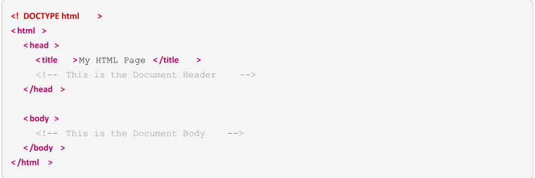

Vamos analisá-la em detalhes.

Anatomia do HTML

A estrutura básica de um documento HTML é composta por uma série de elementos organizados de maneira hierárquica. Vamos detalhar cada uma das partes fundamentais:

1. DOCTYPE html: Esta declaração define o tipo de documento e a versão do HTML que está sendo utilizada. No caso do HTML5, utilizamos DOCTYPE html.

2. html: A tag html é o elemento raiz de um documento HTML. Todo o conteúdo da página web deve estar contido dentro desta tag.

3. head: A tag head contém metadados sobre o documento, como seu título, links para folhas de estilo CSS, scripts e outras informações que não são exibidas diretamente na página.

   - title: Define o título da página, que aparece na aba do navegador.
   - meta: Fornece metadados como a codificação de caracteres meta charset=UTF-8, descrições e palavras-chave para mecanismos de busca.
   - link: Utilizada para vincular arquivos externos, como folhas de estilo.
   - style: Contém estilos CSS internos.
   - script: Referencia arquivos JavaScript ou contém scripts internos.

4. body: A tag body contém todo o conteúdo visível da página web, como textos, imagens, vídeos, links e outros elementos multimídia.

   - header: Representa a seção de cabeçalho da página ou de uma seção da página, geralmente contendo títulos e navegação.
   - nav: Define uma seção de navegação com links para outras partes da página ou para outras páginas.
   - main: Contém o conteúdo principal da página. Deve ser único por documento.
   - section: Agrupa conteúdo relacionado, geralmente com um cabeçalho.
   - article: Representa uma composição independente, como uma postagem de blog ou um artigo de notícias.
   - aside: Contém conteúdo relacionado à página principal, mas que pode ser considerado como acessório, como barras laterais e widgets.
   - footer: Define o rodapé da página ou de uma seção, geralmente contendo informações de rodapé, como direitos autorais e links de contato.

5. Elementos de bloco e inline:
   - Elementos de bloco: Ocupam toda a largura disponível de seu elemento pai e começam em uma nova linha. Exemplos: div, p, h1 a h6, ul, ol, li.
   - Elementos inline: Ocupam apenas o espaço necessário para o seu conteúdo e não começam em uma nova linha. Exemplos: span, a, img, strong, em.

Entender a anatomia de um documento HTML é essencial para criar páginas web bem estruturadas e semânticas, facilitando a manutenção e a acessibilidade do conteúdo.

# Tags HTML

O HTML usa elementos e tags para descrever e formatar o conteúdo. As tags consistem em parênteses angulares ao redor do nome da tag, por exemplo `<title>`. O nome da tag não faz distinção entre maiúsculas e minúsculas, embora o World Wide Web Consortium (W3C) recomende o uso de minúsculas nas versões atuais do HTML. Essas tags HTML são usadas para construir elementos HTML. A tag `<title>` é um exemplo de tag de abertura de um elemento HTML que define o título de um documento HTML. No entanto, um elemento possui dois outros componentes. Um elemento `<title>` completo seria parecido com este:

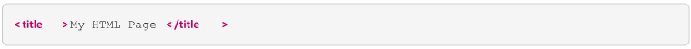

Aqui, My HTML Page representa o conteúdo do elemento, ao passo que `</title>` é a tag de fechamento que declara que este elemento está completo.

Nem todos os elementos HTML precisam ser fechados; nesses casos, falamos de elementos vazios, elementos de auto-fechamento ou elementos nulos. Aqui estão os outros elementos HTML do exemplo anterior:

```html
<html>
  Abrange todo o documento HTML. Contém todas as tags que compõem a página.
  Também indica que o conteúdo deste arquivo está em linguagem HTML. A tag de
  fechamento correspondente é
</html>
```

```html
<head>
  Um receptáculo para todas as metainformações relacionadas à página. A tag de
  fechamento correspondente a este elemento é
</head>
```

```html
<body>
  Um receptáculo para o conteúdo da página e sua representação estrutural. A tag
  de fechamento correspondente é
</body>
```

Um receptáculo para o conteúdo da página e sua representação estrutural. A tag de fechamento correspondente é `</body>`.

As tags `<html>`, `<head>`, `<body>` e `<title>` são as chamadas tags estruturais, que fornecem o esqueleto básico de um documento HTML. Em particular, elas informam o navegador web de que ele está lendo uma página HTML.

Dentre esses elementos HTML, o único que é necessário para um documento HTML ser validado é a tag `<title>`.

# Vamos consultar a documentação do MDN?

Documentação Oficial da Mozilla: [https://developer.mozilla.org/en-US/docs/Web/HTML](https://developer.mozilla.org/en-US/docs/Web/HTML)

# Como definir o título e os parágrafos de um texto

Títulos, subtítulos e parágrafos em HTML são elementos extremamente comuns em quase todos os sites. O bom uso deste elementos de textos podem trazer resultados positivos para a navegação no site e a apresentação dos seu documento HTML

A tag de título principal, é representada pelo `<h1>` e se encerra com `</h1>`, os subtítulos mantém a mesma sintaxe, seguindo a sequência que vai do `<h2>` ao `<h6>`. É recomendado o uso de um `<h1>` por página, como título principal.

Quando utilizamos títulos e subtítulos, podemos usar o `<hgroup>`, esse elemento agrupa os títulos facilitando a navegação dentro do código.

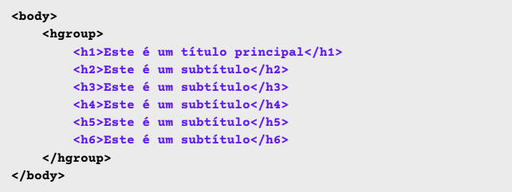

# Utilizando as tags

A tag H1 é usada para determinar o título da página. Conceitualmente existem 6 níveis de títulos sendo o h1 o mais alto de todos, ou seja, ele deve ser usado para indicar o texto mais importante da página.

Exemplo:

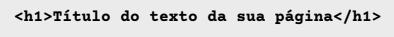

A tag `<p>` é usada para fazer a estruturação de textos em parágrafos dentro de um documento HTML. A princípio todos os textos deverão estar dentro desta tag, exceto:

- Quando o texto for um título, nesta nova condição deverá ser usado as tags `<h1>` a `<h6>`.
- Quando o texto for uma citação, neste caso use a tag `<blockquote>`.
- Quando o texto for uma lista de marcadores ou lista, neste caso use `<ul>` e `<li>` ou `<ol>` e `<li>`.
- Quando for uma legenda, neste caso use `<legend>`

Exemplo de um documento com três parágrafos:

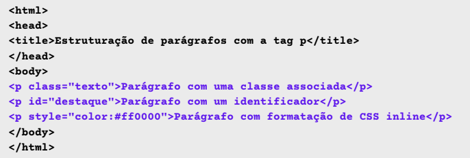

# Inserir imagem

O elemento HTML `` (or HTML Image Element) representa a inserção de imagem no documento, sendo implementado também pelo HTML5 para uma melhor experiência com o elemento `<figure>` e `<figcaption>`.

Exemplo:

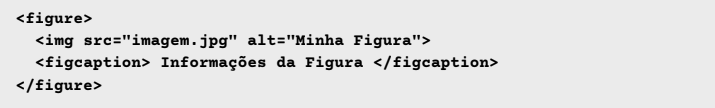

**Atributo SRC:** URL da imagem, este atributo é obrigatório para o `` elemento. Em navegadores que suportam srcset , src é ignorado se este for fornecido.

# Listas ordenadas

Uma lista ordenada em HTML, definida pelo elemento `<ol>`, é uma coleção organizada de itens de lista. O que torna este elemento especial é que a ordem dos itens é relevante. Para enfatizar o fato, os navegadores web exibem números por padrão antes dos elementos filho da lista.

Os elementos `<li>` são os únicos elementos filho válidos dentro de um elemento `<ol>`.

Em nosso exemplo, podemos preencher a programação da festa ao ar livre usando um elemento `<ol>` com o seguinte código:

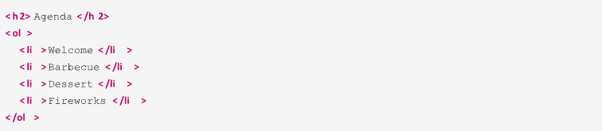

Em um navegador web, esse código HTML produz o resultado mostrado:

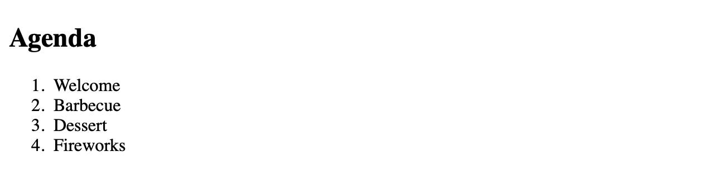

# Listas não ordenadas

Uma lista não ordenada contém uma série de itens de lista que, ao contrário daqueles em uma lista ordenada, não têm uma ordem ou sequência especial. O elemento HTML para esse tipo de lista é `<ul>`. Também neste caso, `<li>` é o elemento HTML que demarca os itens de lista.

Os elementos `<li>` são os únicos elementos filho válidos dentro de um elemento `<ul>`.

Em nosso site de exemplo, podemos usar uma lista não ordenada para sugerir os itens que os convidados devem trazer para a festa. Usamos para isso o seguinte código HTML:

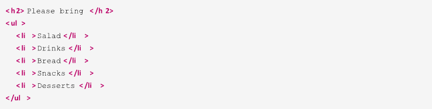

Em um navegador da web, esse código HTML produz o resultado mostrado:

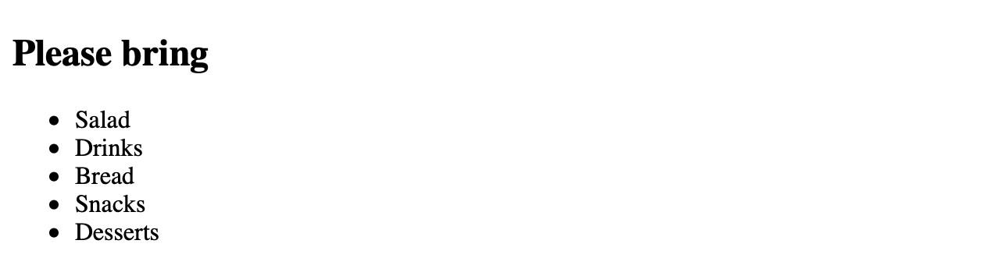

Por padrão, cada item da lista é representado por um marcador circular. É possível alterar a aparência do marcador usando CSS, o que será discutido em lições posteriores.

# Comportamentos das tags

No desenvolvimento web, as tags HTML são classificadas em dois tipos principais: **inline** e **block**. As tags inline são elementos que não iniciam uma nova linha e ocupam apenas o espaço necessário para o seu conteúdo. Elas são usadas principalmente para estilizar partes de texto dentro de um parágrafo ou outro elemento.

Um exemplo comum de tag inline é a tag `<b>`, que serve para destacar texto em negrito. O comportamento padrão da tag `<b>` é simplesmente tornar o texto contido nela mais espesso, ou seja, em negrito, sem alterar o fluxo do conteúdo ao redor. Veja o exemplo abaixo:


Neste exemplo, a palavra "negrito" aparecerá destacada em negrito, mas a estrutura do parágrafo não será alterada, e o texto continuará fluindo normalmente na mesma linha.

Outras tags inline com comportamentos padrões incluem:

- **`<i>`:** Aplica itálico ao texto.
- **`<span>`:** Não aplica nenhuma estilização por padrão, mas é útil para aplicar estilos CSS específicos.
- **`<a>`:** Cria um hiperlink, que por padrão é azul e sublinhado (podendo ser modificado via CSS).
- **``:** Insere uma imagem no conteúdo, que se comporta como um elemento inline.

As tags inline são fundamentais para estilizar e formatar textos de maneira precisa sem interromper o fluxo normal do conteúdo. Elas permitem aos desenvolvedores aplicar estilos e funcionalidades a partes específicas de um documento HTML, garantindo flexibilidade e controle sobre a aparência e comportamento do conteúdo web.

# Sintaxe do HTML

A **sintaxe** do HTML refere-se às regras e estrutura que definem como o código HTML deve ser escrito. A sintaxe correta é essencial para garantir que os navegadores possam interpretar e renderizar o conteúdo da página de maneira correta. Aqui estão alguns dos princípios básicos da sintaxe HTML:

1. **Tags de Abertura e Fechamento:** A maioria dos elementos HTML são delimitados por uma tag de abertura e uma tag de fechamento.

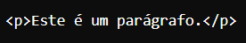

2. **Elementos Auto-Fechados:** Alguns elementos HTML não têm conteúdo e são auto-fechados.

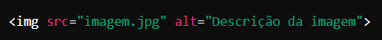

3. **Atributos:** Elementos HTML podem ter atributos que fornecem informações adicionais sobre o elemento. Os atributos são escritos dentro da tag de abertura.

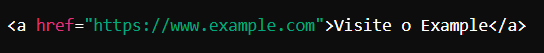

4. **Aninhamento de Elementos:** Elementos HTML podem ser aninhados uns dentro dos outros, mas é importante garantir que eles estejam corretamente aninhados e fechados na ordem correta.

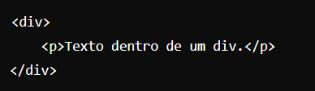

5. **Comentários:** Comentários podem ser adicionados ao HTML e são ignorados pelo navegador. Eles são úteis para anotações e organização do código.

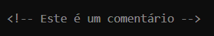

# Semântica do HTML

A **semântica** do HTML refere-se ao significado e propósito dos elementos HTML. Utilizar tags semânticas ajuda a melhorar a acessibilidade, SEO (Search Engine Optimization) e a clareza do código. Tags semânticas são aquelas que descrevem claramente o conteúdo que elas envolvem. Aqui estão alguns exemplos de elementos semânticos:

- **`<header>`:** Representa a seção de cabeçalho de um documento ou de uma seção.
- **`<nav>`:** Representa uma seção de navegação contendo links para outras partes do site ou para outras páginas.
- **`<section>`:** Representa uma seção genérica de um documento, como capítulos, cabeçalhos ou qualquer outra parte distinta do conteúdo.

Utilizar a semântica correta no HTML não apenas melhora a acessibilidade e a experiência do usuário, mas também facilita a manutenção do código e a colaboração entre desenvolvedores. É importante escolher as tags que melhor descrevem o propósito e o significado do conteúdo que está sendo apresentado.
