# Dia 05 (17/06/2024)

Bem-vindos ao nosso dia de aprendizado sobre CSS! Hoje, vamos explorar juntos os fundamentos que tornarão suas páginas web visualmente atraentes e funcionais. Nosso objetivo é capacitá-los com as habilidades necessárias para estilizar elementos HTML usando CSS inline, o atributo style, a tag style, e arquivos CSS externos. Além disso, vamos nos aprofundar em seletores, classes, unidades absolutas e relativas, e no uso de fontes personalizadas através do Google Fonts.

Preparem-se para uma jornada prática e enriquecedora, onde cada conceito aprendido será aplicado em atividades que fortalecerão seu entendimento e confiança no uso do CSS. Vamos transformar suas ideias em realidade e dar vida às suas páginas web com estilos elegantes e eficientes.

Vamos começar essa jornada de aprendizado juntos!

# Introdução ao CSS

O HTML sozinho não tem muita versatilidade para construir interfaces mais elaboradas, nem recursos de programação de finalidade geral. Por esse motivo, um documento HTML que deve funcionar como um aplicativo cliente vem sempre acompanhado por um ou mais conjuntos de CSS e JavaScript.

O CSS pode ser fornecido como um arquivo separado ou diretamente no próprio arquivo HTML. O principal objetivo do CSS é refinar a aparência e o layout dos elementos da interface HTML. Embora isso não seja estritamente necessário, as interfaces mais sofisticadas geralmente requerem modificações nas propriedades CSS dos elementos para atender às suas necessidades.

Depois de criar algumas páginas HTML simples, você provavelmente percebeu que elas são feiosas quando comparadas às páginas bem projetadas que vemos comumente na Internet. Isso ocorre porque, no HTML moderno, o código de marcação destinado à estrutura e função dos elementos no documento (ou seja, o conteúdo semântico) é separado das regras que definem a aparência dos elementos (a apresentação). As regras de apresentação são escritas em uma linguagem diferente, chamada Cascading Style Sheets (CSS). Ela permite alterar quase todos os aspectos visuais do documento, como fontes, cores e o posicionamento dos elementos ao longo da página.

# O CSS inline

O CSS inline é usado para dar estilo a um elemento HTML específico. Para este estilo de CSS você somente vai precisar adicionar o atributo style para cada tag HTML, sem usar os seletores.

Este tipo de CSS não é realmente recomendado, já que cada tag HTML precisa ser estilizada de maneira individual. Gerenciar o seu site pode se tornar uma tarefa bem difícil de você só usar o CSS inline.

Contudo, o CSS inline no HTML pode ser útil para algumas situações. Por exemplo, em casos onde você não tem acesso aos arquivos CSS ou precisa aplicar estilos para um único elemento. Vamos dar uma olhada num exemplo. Aqui, nós adicionamos um CSS inline para as tags `
` e `<h1>`:

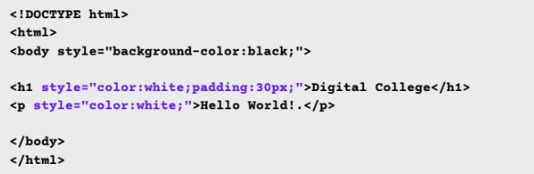

# O atributo style

A maneira mais simples de modificar o estilo de um elemento específico é escrevê-lo diretamente na tag do elemento usando o atributo style. Todos os elementos HTML visíveis aceitam um atributo style, cujo valor pode ser uma ou mais regras de CSS, também conhecidas como propriedades. Vamos começar com um exemplo simples, um elemento de parágrafo:

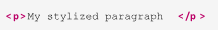

A sintaxe básica de uma propriedade CSS personalizada é property: value, onde property é o aspecto particular que você deseja alterar no elemento e value define o que substituirá a opção padrão feita pelo navegador. Algumas propriedades se aplicam a todos os elementos e outras se aplicam apenas a elementos específicos. Da mesma forma, existem valores adequados a serem utilizados em cada propriedade.

Para mudar a cor do nosso parágrafo simples, por exemplo, usamos a propriedade color. A propriedade color refere-se à cor do primeiro plano, ou seja, a cor das letras do parágrafo. A cor em si é indicada na parte do valor da regra e pode ser especificada em vários formatos diferentes, incluindo nomes simples como red, green, blue, yellow etc. Assim, para deixar a letra do parágrafo roxa, adicione a propriedade personalizada color: purple ao atributo style do elemento:

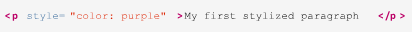

Outras propriedades personalizadas podem entrar na mesma propriedade style, mas devem ser separadas por ponto e vírgula. Se você quiser aumentar o tamanho da fonte, por exemplo, adicione font-size: larger à propriedade style:

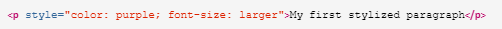

Para ver o resultado dessas alterações, salve o HTML a seguir em um arquivo e abra-o em um navegador web:

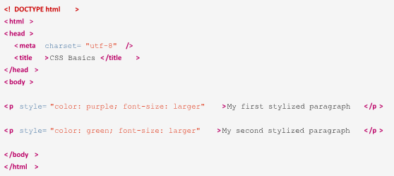

# Regras de CSS

Em vez de estilizar os elementos diretamente nos atributos style de cada um deles, é muito mais prático informar ao navegador sobre a coleção inteira de elementos aos quais o estilo personalizado se aplica. Para isso, adicionamos um seletor às propriedades personalizadas, combinando elementos por tipo, classe, ID único, posição relativa etc. A combinação de um seletor com as propriedades personalizadas correspondentes — o que também chamamos de declarações — constitui uma regra de CSS. A sintaxe básica de uma regra de CSS é selector { property: value }. Como no caso do atributo style, propriedades separadas por ponto e vírgula podem ser agrupadas, como em p { color:purple; font-size: larger }. Essa regra pega todos os elementos p da página e aplica as propriedades personalizadas color e font-size.

Uma regra de CSS para um elemento pai abarcará automaticamente todos os seus elementos filhos. Assim, podemos aplicar propriedades personalizadas a todo o texto da página, independentemente de ele estar dentro ou fora de uma tag 
, usando o seletor body: body { color: purple; font-size: larger }. Essa estratégia nos livra de precisar escrever a mesma regra novamente para todos os elementos filhos, embora possa ser necessário escrever regras adicionais para “desfazer” ou modificar as regras herdadas.

# A tag style

A tag `<style>` permite escrever regras de CSS dentro da página HTML que queremos estilizar. Ela permite ao navegador diferenciar o código CSS do código HTML. A tag `<style>` entra na seção head do documento:

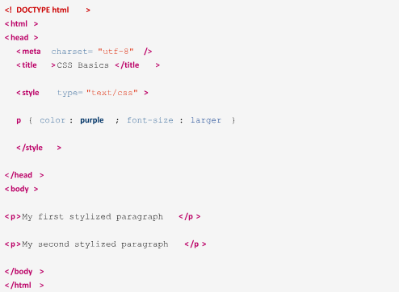

O atributo type informa ao navegador qual tipo de conteúdo está dentro da tag `<style>`, ou seja, seu tipo MIME. Como todo navegador que suporta CSS pressupõe que o tipo da tag `<style>` é text/css por padrão, a inclusão do atributo type é opcional. Há também um atributo media que indica o tipo de mídia — monitores ou impressão, por exemplo — a que se aplicam as regras de CSS na tag `<style>`. Por padrão, as regras de CSS se aplicam a qualquer mídia em que o documento for exibido.

Como no código HTML, as quebras de linha e o recuo de código não alteram a forma como as regras de CSS são interpretadas pelo navegador. Se escrevermos:

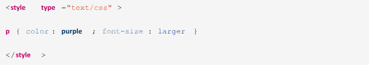

O resultado será exatamente igual ao de:

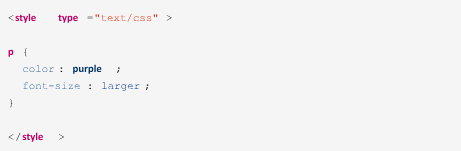

Os bytes extras ocupados pelos espaços e quebras de linha fazem pouca diferença no tamanho final do documento e não têm um impacto significativo no tempo de carregamento da página, portanto a escolha do layout é questão de gosto. Observe o ponto e vírgula após a última declaração (fontsize: larger;) da regra de CSS. Esse ponto e vírgula não é obrigatório, mas sua presença facilita a inclusão de outra declaração na linha seguinte sem se preocupar com a falta de um ponto e vírgula.

As declarações em linhas separadas também ajudam quando precisamos comentar uma declaração. Sempre que você quiser desabilitar temporariamente uma declaração para, por exemplo, resolver um problema na página, basta colocar a linha correspondente entre /_ e _/:

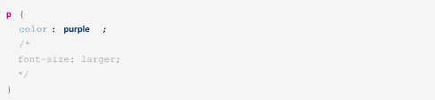

# CSS em arquivos externos

O método mais usado para associar definições CSS a um documento HTML é armazenar o CSS em um arquivo separado. Este método oferece duas vantagens principais sobre os anteriores:

- As mesmas regras de estilo podem ser compartilhadas entre documentos distintos.

- O arquivo CSS geralmente é armazenado em cache pelo navegador, acelerando os tempos de carregamento futuros. Os arquivos CSS têm a extensão .css e, como os arquivos HTML, podem ser editados em qualquer editor de texto simples. Ao contrário dos arquivos HTML, os arquivos CSS não têm uma estrutura em níveis construída com tags hierárquicas, como `<head>` ou `<body>`. Em vez disso, o arquivo CSS é apenas uma lista de regras processadas em ordem sequencial pelo navegador. As mesmas regras escritas dentro de uma tag `<style>` poderiam constar em um arquivo CSS.

A associação entre o documento HTML e as regras de CSS armazenadas em um arquivo é definida apenas no documento HTML. Para o arquivo CSS, não importa se existem elementos que correspondem às suas regras e, portanto, não há necessidade de enumerar no arquivo CSS os documentos HTML aos quais ele está vinculado. No lado do HTML, todas as folhas de estilo vinculadas serão aplicadas ao documento, como se as regras estivessem escritas em uma tag `<style>`.

A tag HTML `<link>` define uma folha de estilo externa a ser usada no documento atual e deve constar da seção head do documento HTML:

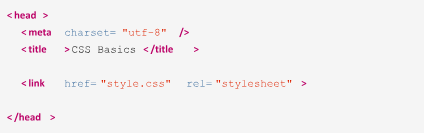

# Estilos de página inteira

Uma das vantagens de se usar CSS é não precisar escrever regras individuais para elementos que compartilham o mesmo estilo. Um asterisco aplica a regra a todos os elementos da página web, como mostrado no exemplo a seguir:

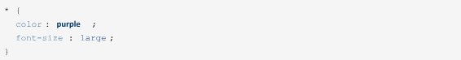

O seletor \* não é o único método para se aplicar uma regra de estilo a todos os elementos da página. Um seletor que usa um nome de tag para aplicar estilos aos elementos contidos nessa tag é chamado de seletor de tipo; assim, qualquer nome de tag HTML, como body, p, table, em, etc., pode ser usado como seletor. No CSS, o estilo do pai é herdado pelos elementos filhos. Portanto, na prática, usar o seletor \_ tem o mesmo efeito que aplicar uma regra ao elemento body:

Além disso, o recurso de cascata do CSS permite ajustar as propriedades herdadas de um elemento. Você pode escrever uma regra CSS geral que se aplica a todos os elementos da página e, em seguida, escrever regras para elementos ou conjuntos de elementos específicos.

Se o mesmo elemento corresponder a duas ou mais regras conflitantes, o navegador aplicará a regra do seletor mais específico. Veja por exemplo as seguintes regras de CSS:

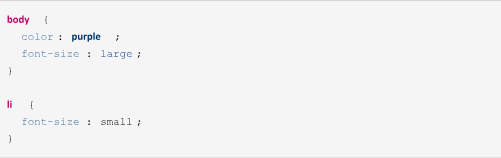

O navegador aplicará os estilos color: purple e font-size: large a todos os elementos dentro do elemento body. No entanto, se houver elementos li na página, o navegador substituirá o estilo fontsize: large pelo estilo font-size: small, porque o seletor li tem uma relação mais forte com o elemento li do que o seletor body.

O CSS não limita o número de seletores equivalentes na mesma folha de estilo, de forma que é possível definir duas ou mais regras usando o mesmo seletor:

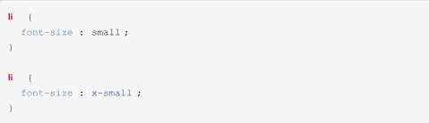

Nesse caso, ambas as regras são igualmente específicas para o elemento li. O navegador não pode aplicar regras conflitantes, então ele escolherá a regra que aparece em último lugar no arquivo de CSS. Para evitar confusão, a recomendação é agrupar todas as propriedades que usam o mesmo seletor.

A ordem em que as regras aparecem na folha de estilo afeta a forma como são aplicadas no documento, mas podemos contornar esse comportamento usando uma regra important. Se, por algum motivo, você quiser manter as duas regras li separadas, mas forçar a aplicação da primeira em vez da segunda, marque a primeira regra como importante:

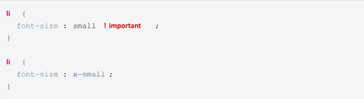

É preciso usar com cautela as regras !Important, pois elas quebram a cascata natural da folha de estilo e tornam mais difícil encontrar e corrigir problemas no arquivo CSS.

# Seletores restritivos

Vimos que é possível alterar certas propriedades herdadas usando seletores correspondentes a tags específicas. No entanto, é comum precisarmos usar estilos distintos em elementos do mesmo tipo.

Podemos incorporar atributos de tags HTML aos seletores para restringir o conjunto de elementos aos quais eles se referem. Suponha que a página HTML em que você está trabalhando tem dois tipos de listas não ordenadas `<ul>`: um deles é usado no topo da página como um menu para as seções do site e o outro em listas convencionais no corpo do texto:

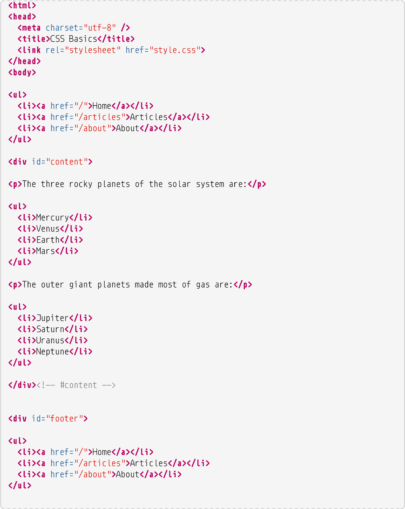

Por padrão, aparece um círculo preto à esquerda de cada item da lista. Queremos remover os círculos da lista do menu superior, mas preservar os círculos na outra lista. No entanto, se simplesmente usarmos o seletor li, os círculos na lista que está na seção do corpo do texto também serão removidos. É necessário pedir ao navegador para modificar apenas os itens de uma lista, mas não da outra.

Existem diversas maneiras de escrever seletores que correspondam a elementos específicos na página. Como mencionado anteriormente, veremos primeiro como usar os atributos dos elementos para isso. Neste exemplo em particular, podemos usar o atributo id para especificar apenas a lista superior.

O atributo id atribui um identificador único ao elemento correspondente, que podemos usar como parte do seletor da regra de CSS. Antes de escrever a regra, edite o arquivo HTML de exemplo e adicione id="topmenu" ao elemento ul usado para o menu superior:

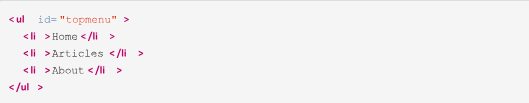

Já existe um elemento link na seção head do documento HTML apontando para o arquivo de folha de estilo style.css na mesma pasta, por isso podemos adicionar as seguintes regras CSS a ele:

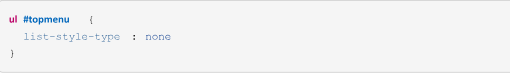

A cerquilha é usada em um seletor, após um elemento, para designar um ID (sem espaço de separação). O nome da tag à esquerda da cerquilha é opcional, pois não haverá outro elemento com o mesmo ID. Portanto, o seletor pode ser escrito apenas como #topmenu.

Embora list-style-type não seja uma propriedade direta do elemento ul, as propriedades CSS do elemento pai são herdadas por seus filhos, de modo que o estilo atribuído ao elemento ul será herdado por seus elementos filhos li.

Nem todos os elementos têm um ID pelo qual podem ser selecionados. Na verdade, é preferível que apenas alguns elementos-chave de layout em uma página tenham IDs. Veja as listas de planetas usadas no nosso código, por exemplo. Embora seja possível atribuir IDs exclusivos para cada elemento repetido individual, esse método não seria prático para páginas mais longas, com muito conteúdo. Em vez disso, podemos usar o ID do elemento div pai como seletor para alterar as propriedades de seus elementos internos.

No entanto, o elemento div não está diretamente relacionado às listas em HTML; portanto, adicionar a propriedade list-style-type a ele não terá efeito em seus filhos. Assim, para trocar o círculo preto nas listas dentro do conteúdo div por um círculo vazado, precisamos usar um seletor descendente:

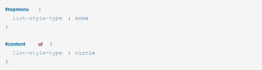

O seletor #content ul é chamado de seletor descendente porque corresponde apenas aos elementos ul que são filhos do elemento cujo ID é content. Podemos usar tantos níveis de descendência quantos forem necessários. Por exemplo, #content ul li corresponderia apenas aos elementos li descendentes dos elementos ul, que por sua vez são descendentes do elemento cujo ID é content. Mas, neste exemplo, o seletor mais longo terá o mesmo efeito que #content ul, já que os elementos li herdam as propriedades CSS definidas para seu ul pai. Os seletores descendentes se tornam uma técnica essencial à medida que o layout da página cresce em complexidade.

Digamos que agora você deseja alterar a propriedade font-style dos itens da lista topmenu e da lista no div de rodapé para torná-los oblíquos. Não é possível simplesmente escrever uma regra de CSS usando ul como seletor, porque isso também vai alterar os itens da lista no div de conteúdo. Até agora, modificamos as propriedades CSS usando um seletor por vez, e esse método também pode ser usado para esta tarefa:

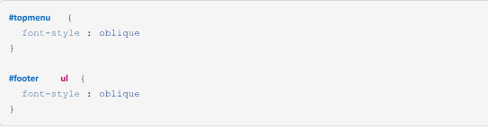

No entanto, os seletores separados não são a única maneira de fazer isso. O CSS nos permite agrupar seletores que compartilham um ou mais estilos, usando uma lista de seletores separados por vírgulas:

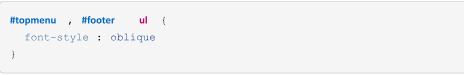

O agrupamento de seletores elimina o trabalho extra de escrever estilos duplicados. Além disso, você pode querer alterar a propriedade novamente no futuro e talvez não se lembre de alterá-la em todos os lugares diferentes.

# Classes

Se não quiser se preocupar muito com a hierarquia de elementos, você pode simplesmente adicionar uma class ao conjunto de elementos que deseja personalizar. As classes são semelhantes aos IDs, mas em vez de identificar um único elemento na página, elas identificam um grupo de elementos que compartilham as mesmas características.

Veja por exemplo a página HTML na qual estamos trabalhando nesta lição. É improvável que nas páginas do mundo real encontremos estruturas simples assim, então seria mais prático selecionar um elemento usando apenas as classes ou uma combinação de classes e descendência. Para aplicar a propriedade font-style: oblique às listas de menu usando classes, primeiro precisamos adicionar a propriedade class aos elementos no arquivo HTML. Faremos isso primeiro no menu superior:

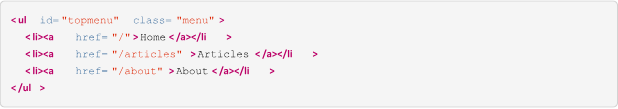

E depois no menu do rodapé:

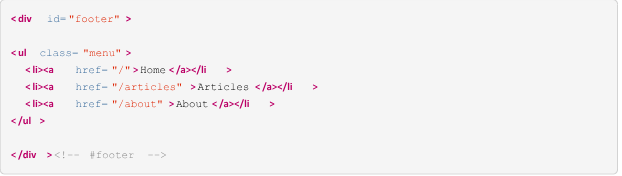

Com isso, podemos substituir o grupo de seletores #topmenu, #footer ul pelo seletor baseado em classe .menu:

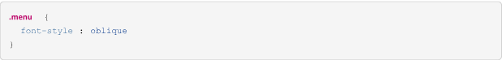

Como no caso dos seletores baseados em ID, adicionar o nome da tag à esquerda do ponto nos seletores baseados em classe é opcional. No entanto, ao contrário dos IDs, a mesma classe pode e deve ser usada em mais de um elemento, e eles sequer precisam ser do mesmo tipo. Portanto, se a classe menu é compartilhada entre diferentes tipos de elementos, o uso do seletor ul.menu afetaria apenas os elementos ul que possuem a classe menu. Mas se usarmos .menu como seletor, qualquer elemento que tenha a classe menu será afetado, independentemente do seu tipo.

Além disso, os elementos podem ser associados a mais de uma classe. Poderíamos diferenciar entre o menu superior e o inferior adicionando uma classe extra a cada um deles:

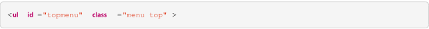

E no menu do rodapé:

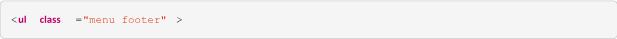

Quando o atributo class possui mais de uma classe, elas devem ser separadas por espaços. Agora, além da regra CSS compartilhada entre os elementos da classe menu, podemos abordar o menu superior e o rodapé usando suas classes correspondentes:

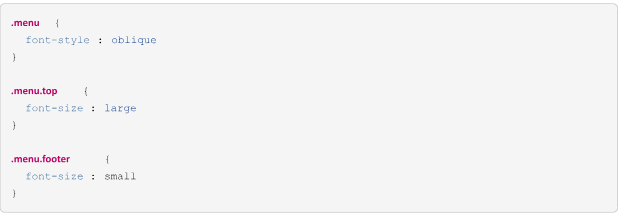

Esteja ciente de que .menu.top é diferente de .menu .top (com um espaço entre as palavras). O primeiro seletor afetará os elementos que têm ambas as classes menu e top, enquanto o segundo afeta os elementos que têm a classe top e um elemento pai com a classe menu.

# Valores de unidade

Os tamanhos e distâncias em CSS podem ser definidos de diferentes maneiras. As unidades absolutas são baseadas em um número fixo de pixels da tela e, portanto, não são tão diferentes dos tamanhos e dimensões fixos usados na mídia impressa. Existem também unidades relativas, que são calculadas dinamicamente a partir de alguma medida fornecida pela mídia onde a página está sendo exibida, como o espaço disponível ou outro tamanho escrito em unidades absolutas.

# Unidades absolutas

As unidades absolutas são equivalentes às suas correspondentes físicas, como centímetros ou polegadas. Nos monitores convencionais, uma polegada tem 96 pixels de largura. As seguintes unidades absolutas são comumente usadas:

in (polegada)

1 in equivale a a 2,54 cm ou 96 px.

cm (centímetro)

1 cm equivale a 96 px / 2,54.

mm (milímetro)

1 mm equivale a 1 cm / 10.

px (pixel)

1 px equivale a 1 / 96 de polegada.

pt (ponto)

1pt equivale a 1 / 72 de polegada.

Lembre-se de que a proporção de pixels por polegada pode variar. Nas telas de alta resolução, onde os pixels são compactados com mais densidade, uma polegada corresponderá a mais de 96 pixels.

# Unidades relativas

As unidades relativas variam de acordo com as outras medidas ou com as dimensões da janela de visualização. A janela de visualização é a área do documento atualmente visível em sua janela. No modo de tela inteira, a janela de visualização corresponde à tela do dispositivo. As seguintes unidades relativas são comumente usadas:

%

Porcentagem — é relativa ao elemento pai.

em

O tamanho da fonte usada no elemento.

rem

O tamanho da fonte usada no elemento raiz.

vw

1% da largura da janela de visualização.

vh

1% da altura da janela de visualização.

A vantagem de se usar unidades relativas é poder criar layouts ajustáveis alterando apenas alguns tamanhos determinados. Por exemplo, podemos usar a unidade pt para definir o tamanho da fonte no elemento do corpo e a unidade rem para as fontes dos outros elementos. Depois de alterar o tamanho da fonte do corpo, todos os outros tamanhos de fonte serão ajustados a partir dali. Além disso, o uso de vw e vh para definir as dimensões das seções da página as torna ajustáveis para telas de tamanhos diferentes.

# Propriedades das fontes e do texto

A tipografia, ou o estudo dos tipos de fonte, é um assunto muito amplo dentro do design, e a tipografia CSS não fica para trás. No entanto, existem algumas propriedades básicas de fonte que atenderão às necessidades da maioria dos usuários que estão aprendendo CSS.

A propriedade font-family define o nome da fonte a ser usada. Não há garantia de que a fonte escolhida estará disponível no sistema onde a página será visualizada, portanto esta propriedade talvez não tenha efeito no documento. Embora seja possível fazer o navegador baixar e usar o arquivo de fonte especificado, a maioria dos webdesigners prefere usar uma família de fontes genérica em seus documentos.

As três famílias de fontes genéricas mais comuns são serif, sans-serif e monospace. Serif é a família de fontes padrão da maioria dos navegadores. Se você preferir usar sans-serif para a página inteira, adicione a seguinte regra à sua folha de estilo:

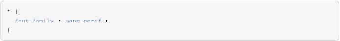

Opcionalmente, podemos primeiro definir um nome específico de família de fonte, seguido pelo nome de família genérico:

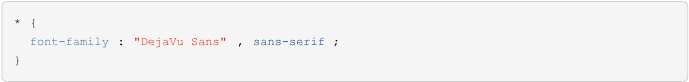

Se o dispositivo que exibe a página tiver essa família de fontes específica, o navegador a usará. Caso contrário, ele usará a fonte padrão correspondente ao nome de família genérico. Os navegadores procuram pelas fontes na ordem em que elas estão especificadas na propriedade.

Qualquer pessoa que tenha usado um aplicativo de processamento de texto também estará familiarizado com três outros ajustes de fonte: tamanho, peso e estilo. Esses três ajustes têm seus equivalentes nas propriedades CSS: font-size, font-weight e font-style.

A propriedade font-size aceita palavras-chave de tamanho como xx-small, x-small, small, medium, large, x-large, xx-large, xxx-large. Essas palavras-chave são relativas ao tamanho de fonte padrão usado pelo navegador. As palavras-chave larger e smaller alteram o tamanho da fonte com relação ao tamanho da fonte do elemento pai. Também é possível expressar o tamanho da fonte com valores numéricos, incluindo a unidade após o valor, ou com porcentagens.

Se você não deseja alterar o tamanho da fonte, mas sim a distância entre as linhas, use a propriedade line-height. Uma line-height de 1 torna a altura da linha do mesmo tamanho da fonte do elemento, o que pode deixar as linhas de texto próximas demais umas das outras. Portanto, um valor maior que 1 é mais apropriado para textos. Assim como na propriedade font-size, outras unidades podem ser usadas junto com o valor numérico. font-weight define a espessura da fonte, usando as conhecidas palavras-chave normal ou bold (negrito). As palavras-chave lighter e bolder alteram o peso da fonte do elemento em relação ao peso da fonte de seu elemento pai.

A propriedade font-style pode ser definida como italic para selecionar a versão em itálico da família de fontes atual. O valor oblique seleciona a versão oblíqua da fonte. Essas duas opções são quase idênticas, mas a versão em itálico de uma fonte geralmente é um pouco mais estreita do que a versão oblíqua. Se não houver versões em itálico ou oblíquo da fonte, a fonte será inclinada artificialmente pelo navegador.

Existem outras propriedades que alteram a forma como o texto é processado no documento. Você pode, por exemplo, adicionar um sublinhado a algumas partes do texto que deseja enfatizar.

Primeiro, use uma tag `` para delimitar o texto:

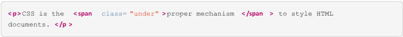

Use então o seletor .under para alterar a propriedade text-decoration:

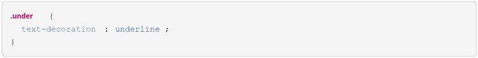

Por padrão, todos os elementos a (link) são sublinhados. Para remover o sublinhado, use o valor none em text-decoration de todos os elementos a:

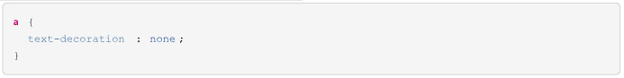

Ao revisar o conteúdo, alguns autores gostam de riscar as partes incorretas ou desatualizadas do texto, para que o leitor saiba que o texto foi atualizado e o que foi removido. Para fazer isso, use o valor line-through da propriedade text-decoration:

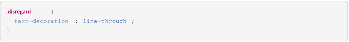

# Google Fonts

Documentação Oficial do Google Fonts: [https://developers.google.com/fonts/docs/css2?hl=pt-br](https://developers.google.com/fonts/docs/css2?hl=pt-br)
