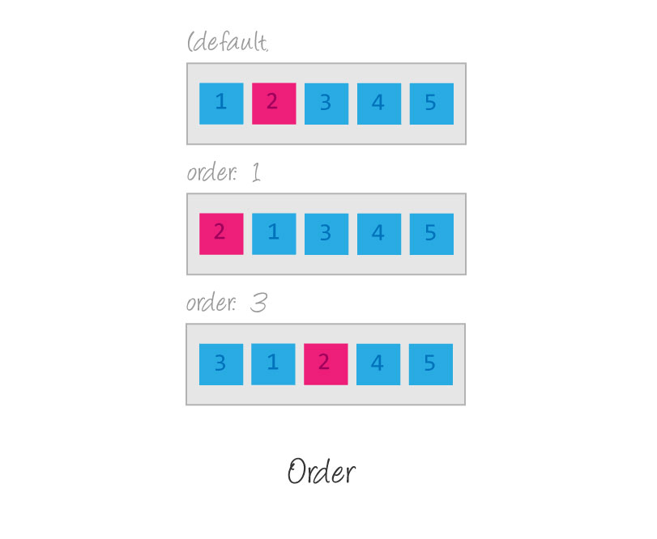

# Dia 08 (20/06/2024)

# Utilizando a Propriedade order no Flexbox

A propriedade CSS define a ordem de layout de um item em um contêiner flexível ou de grade. Os itens em um contêiner são classificados por valor crescente e, em seguida, pela ordem do código-fonte. Os itens que não recebem um valor explícito recebem o valor padrão de 0.

O valor padrão é 0, e valores positivos ou negativos podem ser usados para mover os itens para frente ou para trás na ordem de exibição.



A propriedade order de Flexbox controla a ordem em que flex items aparecem num flex container ao colocá-los em grupos ordinais, atribuindo-se um valor `<integer>` que define a qual grupo ordinal o flex item pertence — sendo que items com o mesmo grupo ordinal são leiautados na ordem em que aparece na camada de conteúdo. O valor inicial de order de todos os flex items é 0 e é possível especificar valores negativos.

OBS.: Apesar de óbvio, vale a pena lembrar que Flexbox faz parte de CSS, então, a ordem é alterada somente na apresentação dos elementos, não afetando em nada a Camada de Conteúdo — inclusive, leitores de tela lerão na ordem do HTML.

# Brincando com a Propriedade order

Imagine que você está organizando seus brinquedos em uma prateleira.

Você tem três brinquedos: um urso, um carro e uma boneca. Normalmente, você coloca esses brinquedos na prateleira na ordem que você os pega da sua caixa de brinquedos. Mas, e se você quiser mudar a ordem dos brinquedos na prateleira sem mexer na caixa?

# Como Funciona?

Vamos dar a cada brinquedo um número mágico chamado order. Esse número vai decidir a posição dos brinquedos na prateleira.

# Exemplo com Brinquedos

1. Urso:

   - Número mágico (order): 2
   - Normalmente: Primeiro na prateleira.

2. Carro:

   - Número mágico (order): 1
   - Normalmente: Segundo na prateleira.

3. Boneca:

   - mágico (order): 3
   - Normalmente: Terceiro na prateleira.

# Vamos Reordenar

Com a varinha mágica order, você diz que o Carro (com número mágico 1) vai ser o primeiro, o Urso (com número mágico 2) vai ser o segundo, e a Boneca (com número mágico 3) vai ser o terceiro.

Aqui está como seus brinquedos são reordenados na prateleira:

# Código HTML

```html
<div class="prateleira">
  <div class="brinquedo" id="carro">Carro</div>
  <div class="brinquedo" id="urso">Urso</div>
  <div class="brinquedo" id="boneca">Boneca</div>
</div>
```

# Código CSS

```css
.prateleira {
  display: flex;
}

#carro {
  order: 1;
}

#urso {
  order: 2;
}

#boneca {
  order: 3;
}
```

# O resultado esperado

```text
Primeiro na prateleira: Carro
Segundo na prateleira: Urso
Terceiro na prateleira: Boneca
```

# Resumindo

A propriedade order é como um número mágico que você dá a cada brinquedo. Esse número decide a posição dos brinquedos na prateleira. Mesmo que os brinquedos estejam na mesma ordem na caixa de brinquedos, a varinha mágica order os reorganiza na prateleira!

# Um jogo para aprender Flexbox

Vamos treinar o Flexbox com um dos sites mais conhecidos mundialmente? Um jogo onde você pode ajudar Froggy e seus amigos ao escrever código CSS!

[CLIQUE AQUI PARA TREINAR!](https://flexboxfroggy.com/#pt-br)

# Revisão Completa do Flexbox

Hoje finalizamos o conteúdo de Flexbox, um conceito que visa organizar os elementos de uma página HTML dentro de seus containers de forma dinâmica. Ou seja, independente das suas dimensões eles sempre manterão um layout flexível dentro do seu elemento pai, reorganizando-se e acordo com a necessidade.

Para ajudar vocês a entenderem mais sobre Direções, Eixos e Empacotamento, temos como sugestão o mais novo conteúdo do Canal Curso em Vídeo. Um dos canais de programação mais conhecidos por todos os estudantes de programação. Vamos aprender com o Gustavo Guanabara?

[https://www.youtube.com/watch?v=YeGn9nGies0](https://www.youtube.com/watch?v=YeGn9nGies0)

# Direções e eixos

[https://www.youtube.com/watch?v=qtGI16QcV1U](https://www.youtube.com/watch?v=qtGI16QcV1U)

# Empacotamento e fluxo no Flexbox

[https://www.youtube.com/watch?v=KRk3tjIZeFI](https://www.youtube.com/watch?v=KRk3tjIZeFI)
