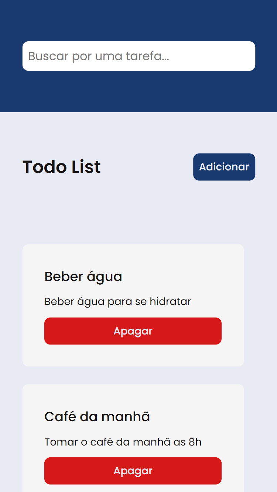
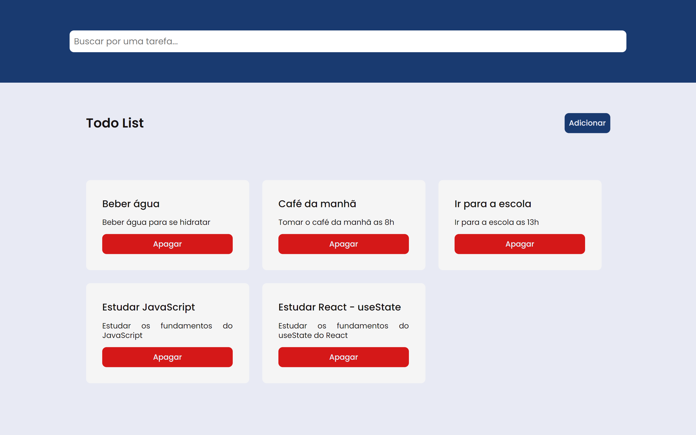

<h1 align="center">Projeto 01 do Curso de Desenvolvimento Web Full Stack do projeto Geração Tech</h1>

# Roteiro

<ul>
  <li>
    <a href="#sobre">Sobre</a>
  </li>
  <li>
    <a href="#tecnologias">Tecnologias</a>
  </li>
  <li>
    <a href="#requisitos">Requisitos</a>
    <ul>
      <li>
        <a href="#requisitos-funcionais">Requisitos Funcionais</a>
      </li>
      <li>
        <a href="#regras-de-negocio">Regras de Negócio</a>
      </li>
      <li>
        <a href="#requisitos-nao-funcionais">Requisitos Não Funcionais</a>
      </li>
    </ul>
  </li>
  <li>
    <a href="#pre-requisitos">Pré-requisitos</a>
  </li>
  <li>
    <a href="#instalacao">Instalação</a>
  </li>
  <li>
    <a href="#executando">Executando</a>
  </li>
  <li>
    <a href="#deploy">Deploy</a>
  </li>
  <li>
    <a href="#autor">Autor</a>
  </li>
  <li>
    <a href="#licenca">Licença</a>
  </li>
</ul>

# Versão Mobile

<p align="center">
  <a href="https://gt-curso-dwfs-projeto-01.netlify.app">
    
  </a>
</p>

# Versão Desktop

<p align="center">
  <a href="https://gt-curso-dwfs-projeto-01.netlify.app">
    
  </a>
</p>

# Sobre

Projeto 01 do Curso de Desenvolvimento Web Full Stack do projeto Geração Tech que o objetivo era desenvolver uma lista de tarefas.

# Tecnologias

- [HTML](https://developer.mozilla.org/pt-BR/docs/Web/HTML)
- [CSS](https://developer.mozilla.org/pt-BR/docs/Web/CSS)
- [JavaScript](https://developer.mozilla.org/pt-BR/docs/Web/JavaScript)
- [JSON Server](https://www.npmjs.com/package/json-server)

# Requisitos

## Requisitos Funcionais

- O usuário deve poder adicionar uma nova tarefa à lista.
- Cada tarefa deve ter um título e uma descrição obrigatória.
- O usuário deve poder visualizar todas as tarefas adicionadas.
- Cada tarefa deve ter um título e descrição obrigatório. Não é permitido adicionar tarefas sem título e descrição.
- O usuário deve poder filtrar as tarefas.
- As tarefas devem ser armazenadas localmente no dispositivo do usuário, permitindo que sejam mantidas entre sessões.

## Regras de Negócio

- Cada tarefa deve ter um título e descrição obrigatório. Não é permitido adicionar tarefas sem título e descrição.

## Requisitos Não Funcionais

- A aplicação deve carregar e exibir a lista de tarefas em menos de 2 segundos.
- A interface deve ser intuitiva e fácil de usar, permitindo que os usuários adicionem e filtrem tarefas sem dificuldades.
- A aplicação deve ser compatível com os principais navegadores (Chrome, Firefox, Safari e Edge) e dispositivos móveis.
- O código da aplicação deve ser bem documentado e seguir boas práticas de desenvolvimento, facilitando futuras manutenções e melhorias.

# Pré-requisitos

1. Ter instalado um editor de código. Recomendo o [VS Code](https://code.visualstudio.com/download)
2. Ter instalado o [Git](https://git-scm.com/downloads)
3. Ter instalado a extensão [Live Server](https://marketplace.visualstudio.com/items?itemName=ritwickdey.LiveServer)
4. Ter instalado o [Node.js](https://nodejs.org/en)

# Instalação

1. Abra o terminal e clone o repositório do projeto:

```bash
git clone https://github.com/pedroeuzebiooo/gt-curso-dwfs-projeto-01
```

# Executando

1. Entre na pasta do projeto clonado:

```bash
cd gt-curso-dwfs-projeto-01
```

2. Abra a pasta do projeto clonado no [VS Code](https://code.visualstudio.com/download/):

```bash
code .
```

3. Instale as dependências do projeto:

```bash
npm install
```

ou

```bash
yarn install
```

ou

```bash
pnpm install
```

4. Execute o projeto:

```bash
npm run dev
```

ou

```bash
yarn run dev
```

ou

```bash
pnpm run dev
```

5. Abra o arquivo `index.html` com a extensão [Live Server](https://marketplace.visualstudio.com/items?itemName=ritwickdey.LiveServer)

# Deploy

- [Deploy do projeto](https://gt-curso-dwfs-projeto-01.netlify.app)

# Autor

<table>
  <tr>
    <td align="center">
      <a href="https://github.com/pedroeuzebiooo">
        
      </a>
      <br>
      Pedro Euzebio
    </td>
  </tr>
</table>

# Licença

O projeto está sob licença MIT. Veja o arquivo [LICENSE](#) para mais detalhes.
